# PaperNest 本地论文库

> PaperNest 面向计算机研究生的 Windows 本地论文工作台：论文库与 PDF 阅读批注、双语术语与写作素材同库沉淀；LLM 自动整理摘要与分类；本地知识树串联相关文献；论文雷达按需发现 alphaxiv / arXiv 新稿。数据全程在本机，无账号与云同步。

<p align="center">
  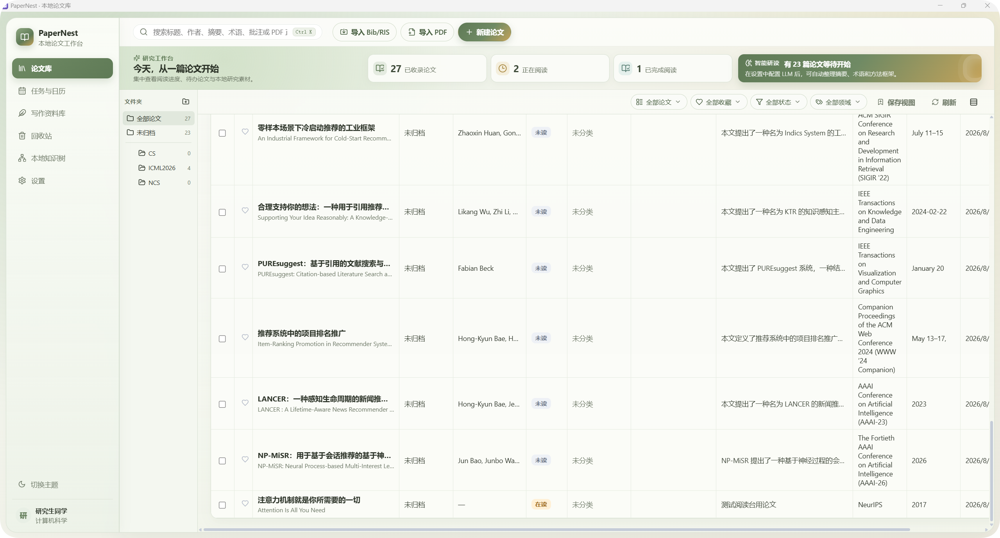
</p>

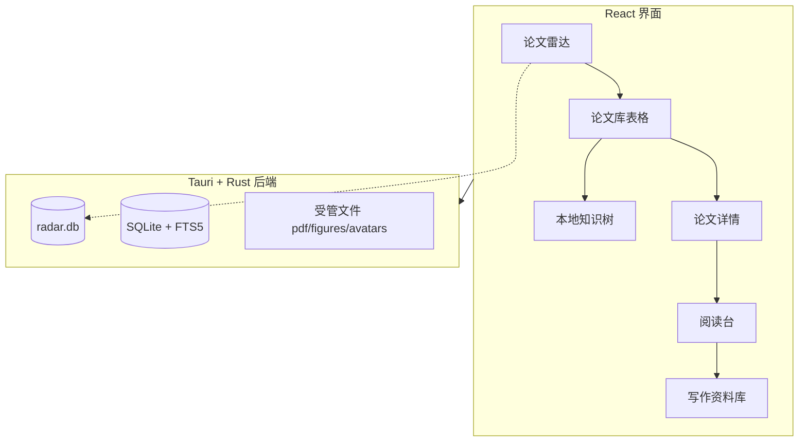
```mermaid
flowchart TB
  subgraph UI["React 界面"]
    Library["论文库表格"]
    Detail["论文详情"]
    Reader["阅读台"]
    Writing["写作资料库"]
    Graph["本地知识树"]
    Radar["论文雷达"]
  end

  subgraph Core["Tauri + Rust 后端"]
    DB[(SQLite + FTS5)]
    RadarDB[(radar.db)]
    Files["受管文件 pdf/figures/avatars"]
  end

  Library --> Detail
  Detail --> Reader
  Reader --> Writing
  Library --> Graph
  Radar --> Library
  UI --> Core
  Radar -.-> RadarDB
```


## 快速开始

### 1. 首次启动

1. 安装并启动 PaperNest。新版 setup 若检测到本机已安装旧版，会提示升级/覆盖安装；**资料库目录** `PaperNestLibrary` **会保留**（卸载时不要勾选「删除应用数据」，否则会清掉路径配置）。
2. 首次启动默认在软件安装目录下创建 `PaperNestLibrary`（可在设置中迁移到其它位置）。资料库文件或目录不可写导致无法打开时，程序复制资料库到本机应用数据目录、切换路径，并在界面显示新路径。
3. 程序会在该目录创建 `library.db`、`pdf/originals`、`figures` 和 `backups`。不要手动移动其中的单个文件。


### 2. 导入与阅读

1. 在论文库右上角点击「导入 PDF」，选择一个或多个 PDF；也可导入 BibTeX/RIS。当前选中文件夹时，导入的论文进入该文件夹。开启 LLM 自动整理时，导入后会填写摘要等信息，并按现有主领域/子领域词表自动分类（无法匹配则保持未分类）。
2. 补充中英文标题、作者、领域、标签和一句话总结。
3. 单击论文打开右侧详情；双击或点击 PDF 图标进入阅读台。
4. 阅读台用 PDF.js 连续滚动阅读：普通滚轮上下翻页，**Ctrl + 滚轮**缩放，顶栏提供高亮、下划线、手绘等批注。


### 3. 批注与知识沉淀

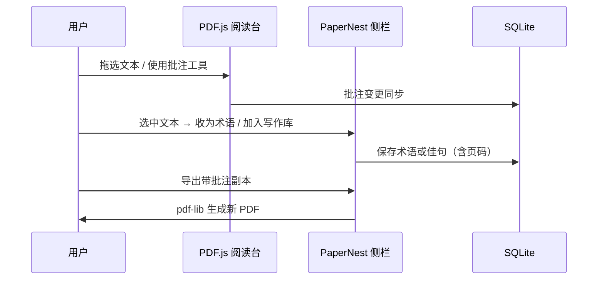
```mermaid
sequenceDiagram
  participant U as 用户
  participant Reader as PDF.js 阅读台
  participant PN as PaperNest 侧栏
  participant DB as SQLite

  U->>Reader: 拖选文本 / 使用批注工具
  Reader->>DB: 批注变更同步
  U->>PN: 选中文本 → 收为术语 / 加入写作库
  PN->>DB: 保存术语或佳句（含页码）
  U->>PN: 导出带批注副本
  PN->>U: pdf-lib 生成新 PDF
```


1. 在阅读台顶栏切换高亮、下划线或手绘，再拖选文字批注。
2. 拖选英文词语或句子，使用浮动工具栏「收为术语」或「加入写作库」。加入写作库时可从下拉选择已有写作用途，也可新增类别。
3. 术语和佳句保留来源论文和页码，可从资料库跳回原文；中文由已配置的 LLM 做学术翻译，LibreTranslate 作本地备用翻译。
4. 导出时生成带可见批注的新 PDF 副本，原始文件不修改。


### 4. 整理、备份与可选服务

- 使用领域、标签、阅读状态、保存视图和全局搜索定位论文。
- 勾选表格第一列可批量移入回收站；回收站中可恢复或永久删除。
- 定期在「设置」中创建完整备份。
- 需要翻译与自动整理时，在设置中配置 LLM；本地 LibreTranslate 需先启动，并填写地址（可只填 `http://127.0.0.1:5000`）。


## 功能概览


| 模块    | 能力                                          |
| ----- | ------------------------------------------- |
| 论文库   | 文件夹树、表格检索、分类标签、保存视图、批量回收站、重复检测         |
| 阅读台   | PDF.js 连续滚动、缩放、批注、撤销/重做                     |
| 学习侧栏  | 速览、批注列表、术语库、框架图（与阅读台同屏）                     |
| 写作资料库 | 英文原句、中文译文、用途标签、回到原文页码                       |
| 本地知识树 | 按领域/标签/文本相似度组织节点，双击定位论文                     |
| 任务日历  | 本地任务，可关联论文；页底阅读打卡（每日新增 + 满 5 分钟阅读）          |
| 论文雷达  | alphaxiv 热点 / arXiv 新稿 / 兴趣召回 / 为你推荐；趋势综述与并行单篇解读；发现期零 PDF |
| 文献调研  | ReAct Agent；**单窗口多轮追问** + 附件/链接 + `fetch_url`；对话/轨迹/候选论文三 Tab（DSH 1:1 UI）；`report.md` + `turns/` + `proposals/`；MCP（`papernest-mcp`） |
| 可选辅助  | OCR、Crossref 元数据、LLM 导入分析与分类、LibreTranslate 翻译 |


### 论文库

<p align="center">
  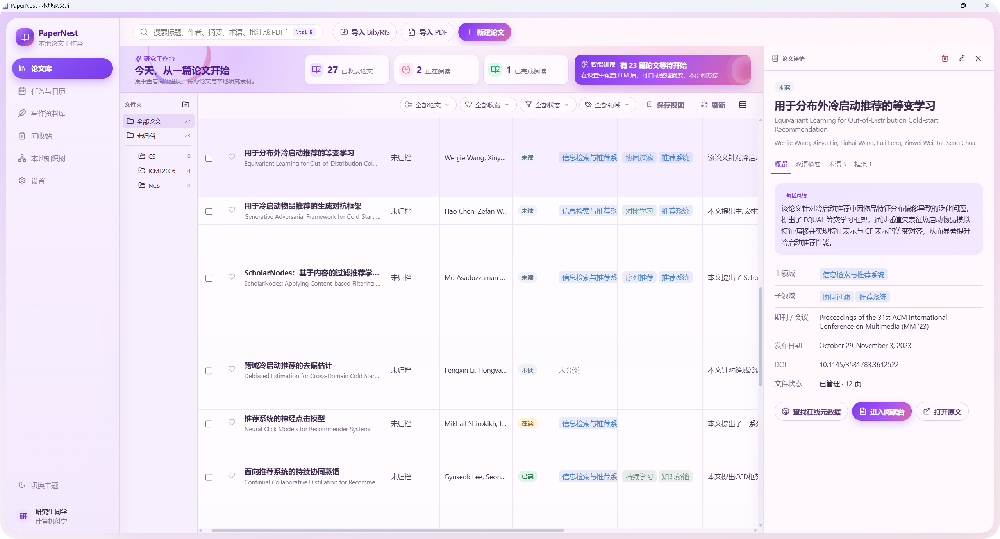
</p>

- 左侧文件夹树按课题/项目组织论文；每篇最多一个文件夹，与主领域/子领域标签并存。
- 表格展示中英文标题、作者、状态、领域、标签、文件夹、一句话总结、期刊/会议、日期和链接。
- Category 为单选主领域，Tags 为多选标签；可维护颜色、名称及合并关系。
- 支持内置视图、保存视图、排序、横向滚动、表格密度切换和全文搜索。
- 导入 PDF 后根据 DOI、arXiv 版本、文件哈希和标题提示已有相同文献；不同 arXiv 版本会作为历史版本交叉引用。
- 封面文本会填写英文摘要，过滤 CCS 分类树、LaTeX 残片和作者上标编号；IEEE 全宽摘要跨栏保留完整；`www.ieee.org` 按域名识别，会议缩写 `WWW` 须带年份。导入时封面与 LLM 共用一次 PDF.js 会话，保证同文件解析一致。
- 论文库表格横向滚动时表头与勾选列同步；标题栏可手动刷新资料库。


### PDF 阅读与学习

阅读台采用 **pdfjs-dist** `PDFPageView` **+ PaperNest 学习侧栏**：

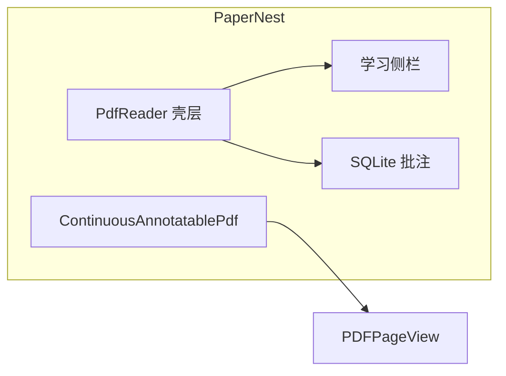
```mermaid
flowchart LR
  subgraph PaperNest
    PdfReader["PdfReader 壳层"]
    ContinuousPdf["ContinuousAnnotatablePdf"]
    StudySidebar["学习侧栏"]
    SQLite["SQLite 批注"]
  end
  ContinuousPdf --> PDFPageView["PDFPageView"]
  PdfReader --> SQLite
  PdfReader --> StudySidebar
```


- 默认在应用右侧以 overlay 打开阅读台，从第 1 页起读。
- PDF.js 负责 canvas、文本层和高 DPI；PaperNest 负责缩放、批注 overlay 与 SQLite 持久化。
- 选中文本后可收录术语或写作佳句；OCR 与带批注导出由壳层处理。


### 资料沉淀

<p align="center">
  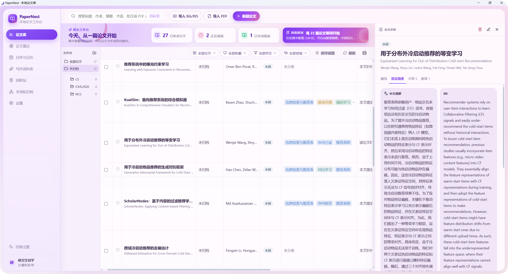
</p>

<p align="center">
  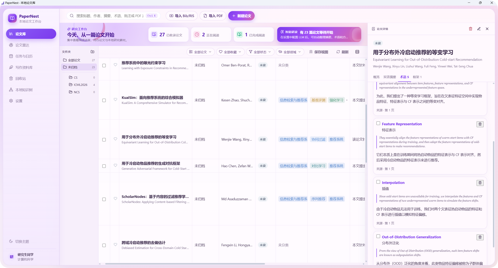
</p>

<p align="center">
  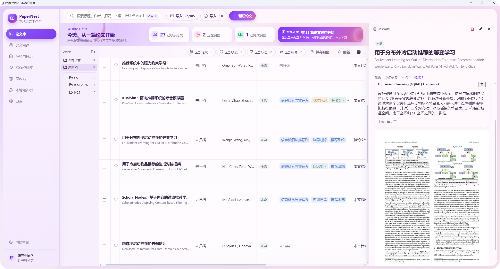
</p>

- 论文详情包含概览、双语摘要、术语/短语和方法框架图。
- 术语条目保存英文词语、中文释义、代表性原句、中文注释、页码和来源批注。
- 写作资料库保存英文原句、中文译文、写作用途、个人改写、标签和回到原文的页码。

<p align="center">
  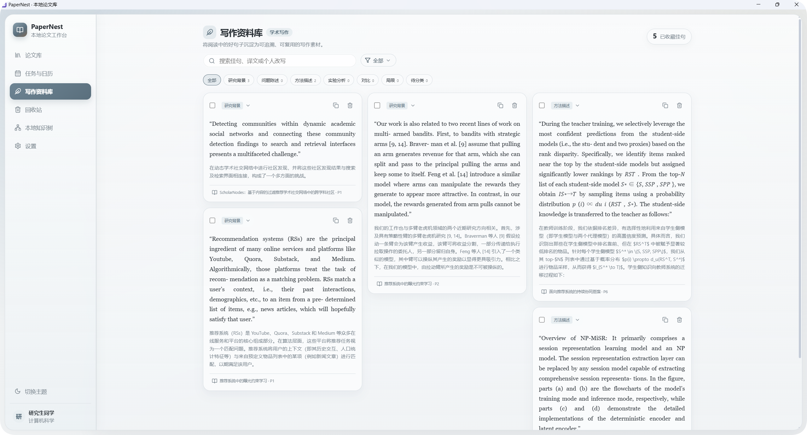
</p>


### 本地知识树

<p align="center">
  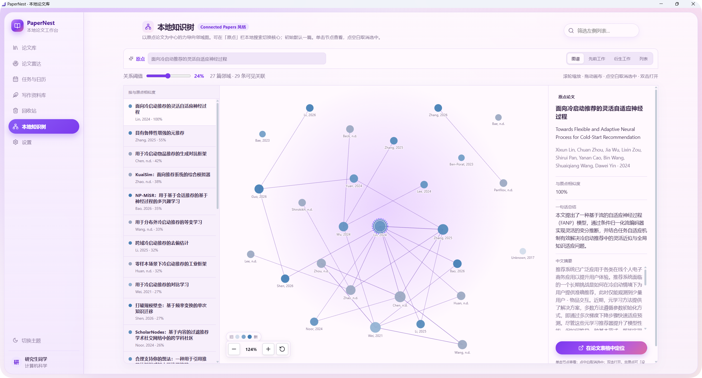
</p>

- 按领域/标签/文本相似度组织节点（Connected Papers 风格布局），双击可在论文库中定位。
- 左侧列出与原点的相关度；右侧展示选中论文的总结与中文摘要。


### 任务与日历

<p align="center">
  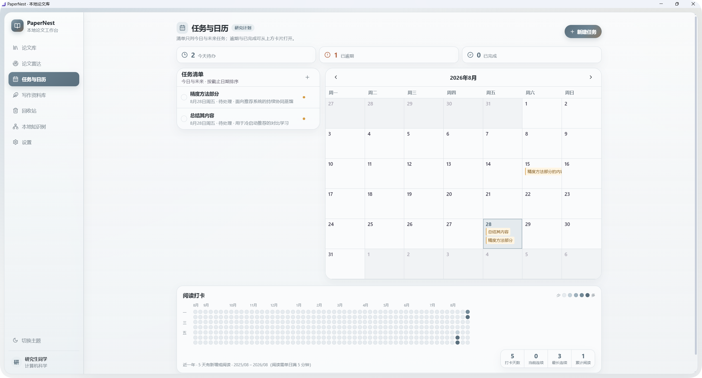
</p>

- 本地任务可关联论文；页底阅读打卡统计每日新增与满 5 分钟阅读。


### 论文雷达（发现层）

默认关闭；启用后进入本页只读本地快照，点击「推荐今日论文」才联网采集。发现期只写 `radar.db` 元数据，**加入论文库**时下载 PDF。

四类榜单（前三路为采集，第四路为排序层）：

| 榜单 | 数据从哪来 | 解决什么问题 |
| --- | --- | --- |
| **alphaxiv 热点榜** | [alphaxiv](https://www.alphaxiv.org) 社区 Hot 榜（排名、点赞、tl;dr） | 看社区当下在追什么 |
| **arXiv 新稿榜** | arXiv 官方 API，按你订阅的 `cs.*` 类目 + 近几日投稿窗 | 看订阅方向的新投稿 |
| **兴趣召回** | 用兴趣关键词做 arXiv 标题/摘要查询（近几日窗 × 订阅类目） | 补 Hot∪New Top-N 之外的相关稿，降低漏检 |
| **为你推荐** | **不新采数据**；在已有快照上按兴趣/规则（可选本地 embedding）排序，空池时级联兜底 | 个性化排序与降级展示 |

另有 **趋势综述**（日/近 7 日 LLM 聚类归纳）与 **单篇解读**（按需 LLM：中文标题/摘要/问题·方法·结论·亮点；可并行解读多篇；「已解读」按钮区分样式；侧栏可删除解读）。顶栏「刷新」重载本地快照。

<p align="center">
  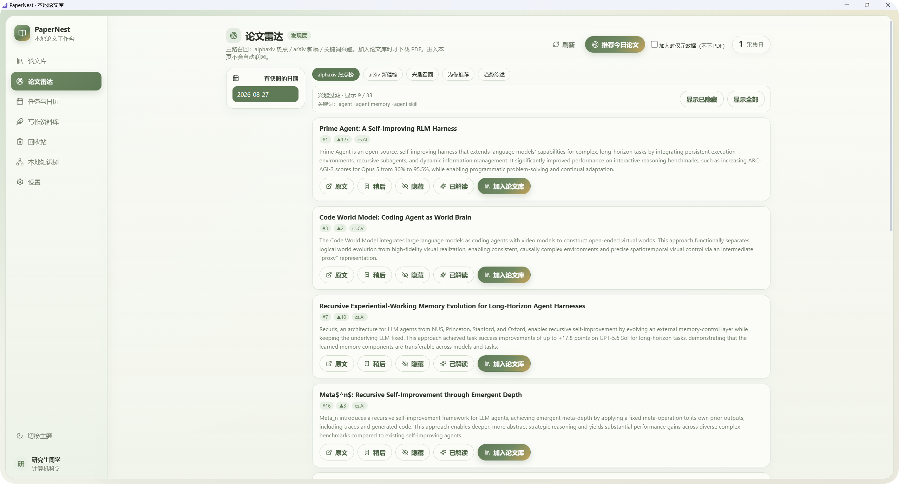
</p>

<p align="center">
  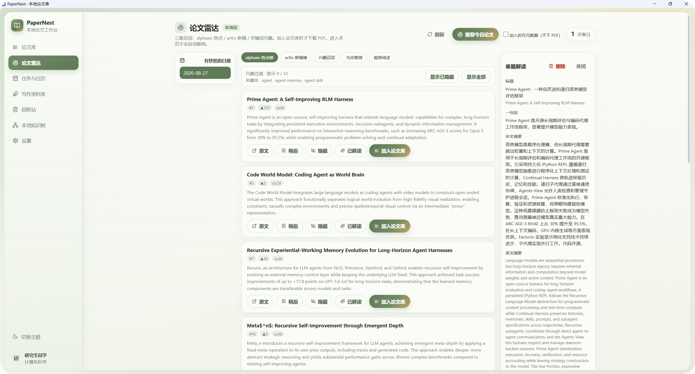
</p>

<p align="center">
  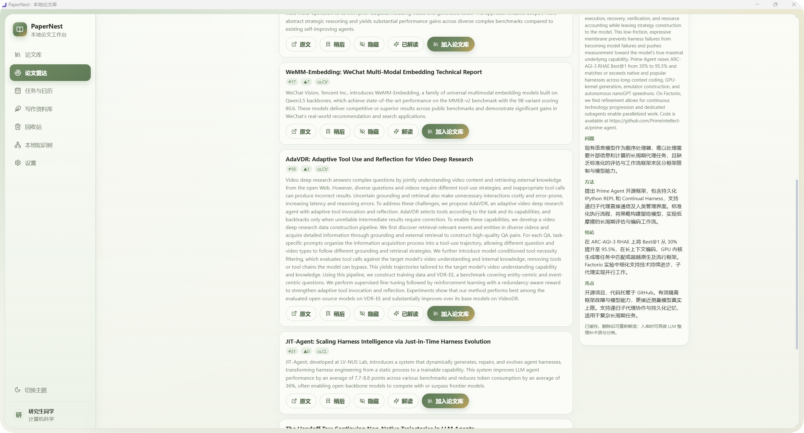
</p>

<p align="center">
  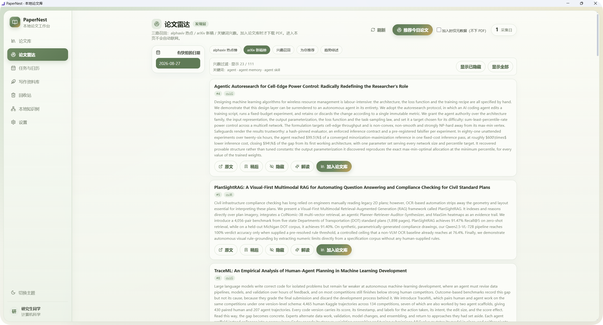
</p>

<p align="center">
  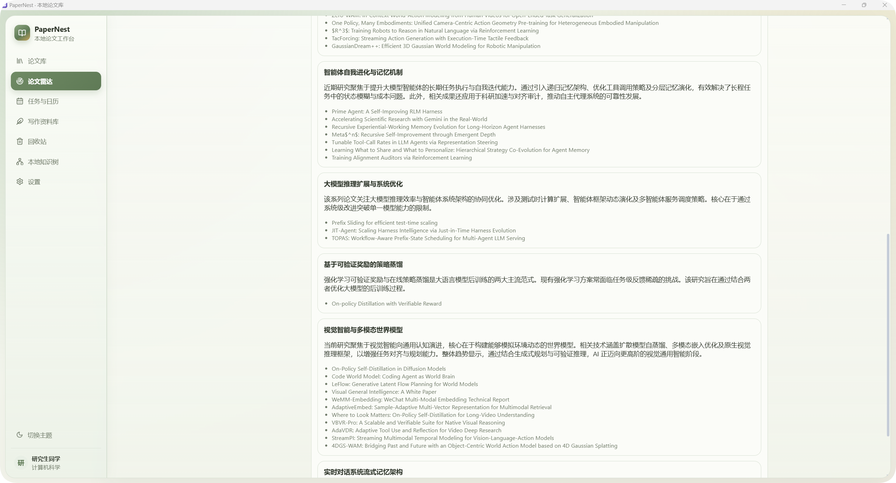
</p>


### 文献调研

- 默认关闭；在 **设置 → 文献调研** 配置独立调研 LLM（与「LLM 自动整理」分开）。
- 侧栏 **文献调研**：填写研究问题 → 创建任务 → **开始调研**。主交付物为项目文件夹内的 `report.md`。
- **附件与链接**：新建与追问的输入框支持拖入/粘贴图片、PDF、Word/Excel/PPT 与纯文本（前端提取文本，图片走多模态）；网址渲染成链接 chip，Agent 用 `fetch_url` 工具按需抓取网页正文。
- Agent 流程（**react 模式**，默认）：LLM ReAct 循环选工具检索 → `finish_research` → Reviewer 门控（最多 2 轮补检索）→ Writer 写报告。
- 主 Agent 可调用 `research_subtopic` 委派子问题；弱 tool 模型自动走 JSON ReAct fallback。
- 可回退 `pipeline` 固定流水线（设置 → 文献调研 → 调研模式）。
- 调研进行中 **ResearchView** 轮询步骤与 DSH 事件；**对话 / 轨迹 / 候选论文**三 Tab：对话为多轮会话流（底部追问框），轨迹为 DeepSeek Harness `TrajectoryView`，候选论文以雷达卡片样式展示未入库来源。
- **单窗口多轮**：调研结束后在对话框继续追问即开新一轮（`turns/NNN.md`），无需新增分支；头部「合并导出」生成 `report-full.md`。报告用 `react-markdown` + `remark-gfm` 标准渲染。
- 轨迹底栏支持 **从此处恢复**、**分叉为新任务**；deep 模式长会话自动压缩。
- 调研完成后，未入库的 arXiv 来源生成 `proposals/`，可在「候选论文」Tab 审批（仅元数据或下载 PDF 入库）。
- 默认工作区：`PaperNestLibrary/research/<session-id>/`；也可指定任意项目文件夹。
- 过程文件：`.dsh-session/`（DSH 事件日志）、`steps/`、`sources.jsonl`、`outline.md`、`turns.jsonl`、`turns/`、`attachments/`。外网论文只记链接与摘要，调研期不下载 PDF。
- **Codex MCP**：设置页复制 `codex mcp add` 命令；`papernest-mcp.exe` 与主程序同目录。


### 导入、搜索与辅助能力

- 支持 PDF、BibTeX 和 RIS 导入；有文本层时建立页级全文索引。
- 扫描版 PDF 可执行本地 Tesseract OCR；无文本层状态会明确提示。
- Crossref 在线元数据补全：默认关闭；在设置中开启后，于论文详情手动「查找在线元数据」，逐字段确认写入。导入 PDF 走本地封面解析。
- 自定义元数据字段：在设置中定义字段类型，于论文详情填写；可选显示为论文库表格列。
- 接入用户自备的 OpenAI 兼容大模型 API，导入时提取双语题目、摘要、总结、术语和框架图候选，并按现有词表自动分类；API Key 只写入 Windows 凭据管理器。

<p align="center">
  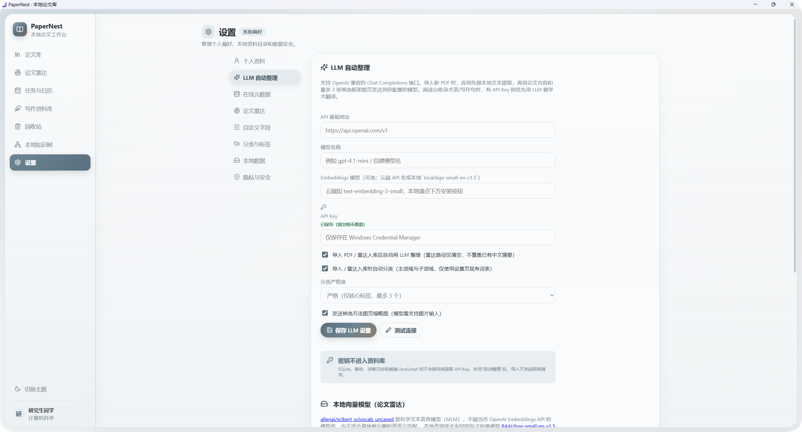
</p>

<p align="center">
  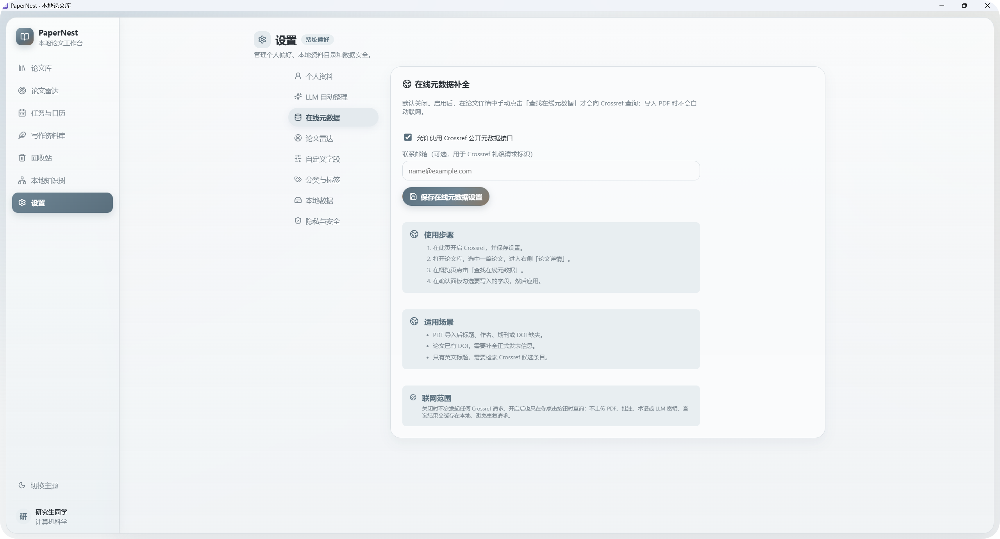
</p>

<p align="center">
  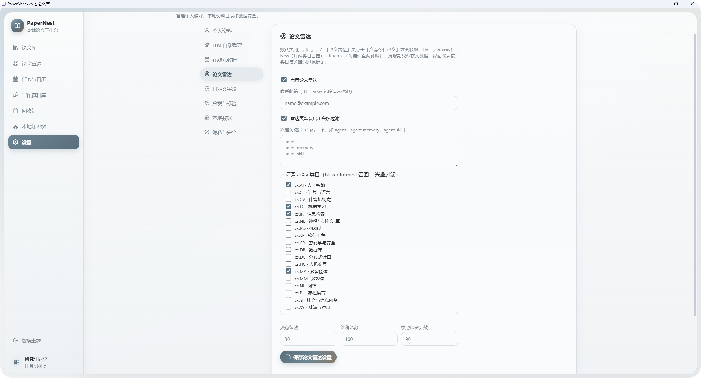
</p>

<p align="center">
  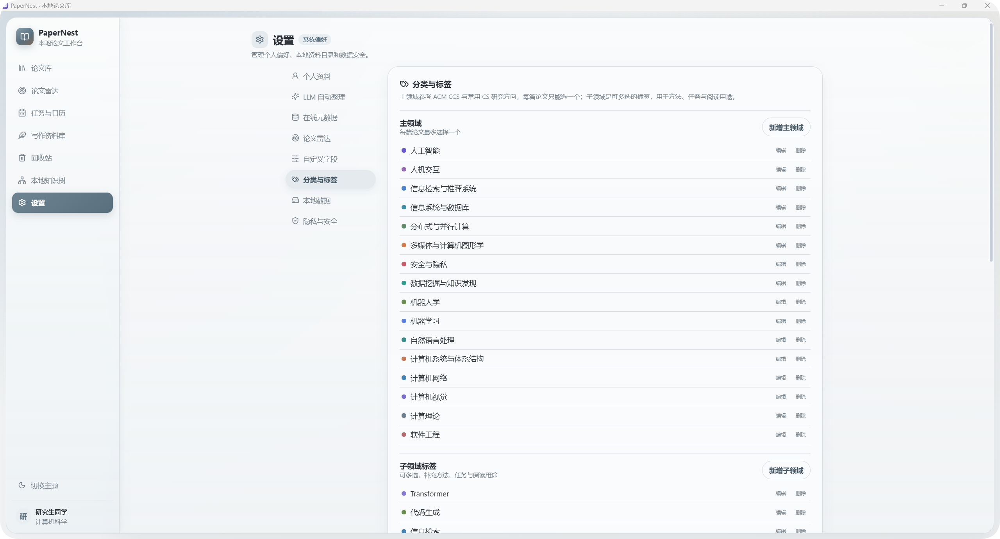
</p>


## 资料库目录结构

```text
<软件安装目录>/PaperNestLibrary/   # 默认；迁移后为用户选定路径
├── library.db              # SQLite 主库（论文、批注、术语、任务等）
├── research.db             # 文献调研会话索引
├── pdf/originals/          # 受管 PDF 原件
├── research/               # 默认调研工作区（每任务一子文件夹）
├── figures/                # 方法框架图
├── avatars/                # 用户头像
├── backups/                # 完整备份包
└── manifest.json           # 备份清单
```


## 翻译服务与换机

学术翻译使用已配置的 LLM；LibreTranslate 作本地备用翻译。


| 方案                | 说明                                                                                                                         |
| ----------------- | -------------------------------------------------------------------------------------------------------------------------- |
| LLM（推荐）           | 设置 → LLM 自动整理；阅读台术语/写作句与导入中文字段按学术语体提示词翻译                                                                                   |
| 本地 LibreTranslate | 先 `scripts/setup-libretranslate.cmd` 安装，再用 `start-libretranslate.cmd` 启动；设置中填写 `http://127.0.0.1:5000`（会自动补全 `/translate`） |
| 模型路径              | `%LOCALAPPDATA%\PaperNest\LibreTranslate`（或仓库内 `.libretranslate-venv`）                                                     |
| 凭据存储              | LLM API Key 在 Windows 凭据管理器；翻译地址在本机 localStorage                                                                           |


## 开发与文档

```powershell
npm install
npm run dev          # 浏览器预览（localStorage 模拟后端）
npm run tauri dev    # 桌面端完整功能
npm run check        # 测试 + 构建
npm run tauri build  # 生成 paper-reader.exe 与 NSIS 安装包
Copy-Item src-tauri\target\release\paper-reader.exe release\windows\PaperNest.exe -Force
Copy-Item src-tauri\target\release\bundle\nsis\PaperNest_*_x64-setup.exe release\windows\ -Force
```


| 文档                                                           | 内容                                          |
| ------------------------------------------------------------ | ------------------------------------------- |
| [开发文档](docs/DEVELOPMENT.md)                                  | 架构分层、模块职责、批注同步流程、数据模型、视觉令牌、验证清单             |
| [界面风格](docs/UI_STYLE.md)                                     | 单一「主题」选项（经典工作台 / 柔光紫 / 雾蓝 / 苔绿暖黄 × 明暗）与视觉规范 |
| [更新记录](docs/CHANGELOG.md)                                    | 版本变更                                        |
| [扩展能力评估](docs/research/metadata-and-extension-assessment.md) | Crossref、Word/浏览器插件、PDF 边界                  |
| [论文雷达评估](docs/research/paper-radar-feature-assessment.md) | 发现层定位、双层保护、稀疏使用与空池降级 |
| [文献调研计划](docs/research/deep-literature-research-assessment.md) | 深度调研定稿、工作区与 MCP 路线 |
| [Trajectory 方案](docs/research/research-trajectory-plan.md) | Phase 9：复用 DSH 官方 session + TrajectoryView |
