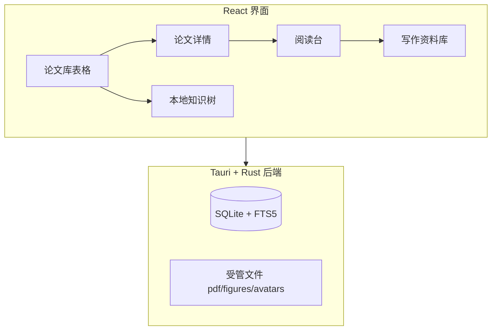
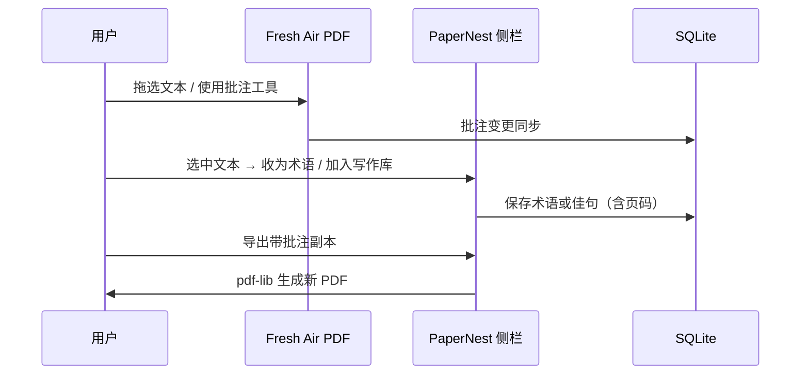
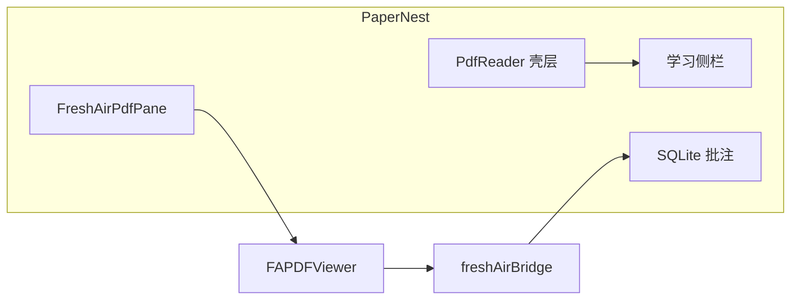

# PaperNest 本地论文库

PaperNest 是面向计算机研究生的 Windows 本地论文管理工具。论文表格、PDF 阅读批注、术语学习、写作素材和本地知识树共用同一资料库；数据保存在本机，无账户与云同步。



## 快速开始

### 1. 首次启动

1. 安装并启动 PaperNest。
2. 首次启动时选择资料库目录。建议选择容量充足、会定期备份的非系统盘。
3. 程序会在该目录创建 `library.db`、`pdf/originals`、`figures` 和 `backups`。不要手动移动其中的单个文件。

### 2. 导入与阅读

1. 在论文库右上角点击「导入 PDF」，选择一个或多个 PDF；也可导入 BibTeX/RIS。
2. 补充中英文标题、作者、领域、标签和一句话总结。
3. 单击论文打开右侧详情；双击或点击 PDF 图标进入阅读台。
4. 阅读台由 [Fresh Air PDF](https://github.com/VeARCTechnologies/FRESH-AIR-PDF) 驱动：普通滚轮上下阅读，**Ctrl + 滚轮**缩放，工具栏提供高亮、下划线、手绘等批注。

### 3. 批注与知识沉淀



1. 在 Fresh Air PDF 工具栏中高亮、下划线或手绘批注。
2. 拖选英文词语或句子，使用浮动工具栏「收为术语」或「加入写作库」。
3. 术语和佳句保留来源论文和页码，可从资料库跳回原文。
4. 导出时生成带可见批注的新 PDF 副本，原始文件不修改。

### 4. 整理、备份与可选服务

- 使用领域、标签、阅读状态、保存视图和全局搜索定位论文。
- 勾选表格第一列可批量移入回收站；回收站中可恢复或永久删除。
- 定期在「设置」中创建完整备份。
- 需要翻译时，首次使用输入 LibreTranslate 兼容地址；免费本地方案见下文。

## 功能概览

| 模块 | 能力 |
|------|------|
| 论文库 | 表格检索、分类标签、保存视图、批量回收站、重复检测 |
| 阅读台 | Fresh Air PDF 内核：连续滚动、缩略图、搜索、批注、撤销/重做 |
| 学习侧栏 | 速览、批注列表、术语库、框架图（与阅读台同屏） |
| 写作资料库 | 英文原句、中文译文、用途标签、回到原文页码 |
| 本地知识树 | 按领域/标签/文本相似度组织节点，双击定位论文 |
| 任务日历 | 本地任务，可关联论文 |
| 可选辅助 | OCR、Crossref 元数据、LLM 导入分析、LibreTranslate 翻译 |

### 论文库

- 表格展示中英文标题、作者、状态、领域、标签、一句话总结、期刊/会议、日期和链接。
- Category 为单选主领域，Tags 为多选标签；可维护颜色、名称及合并关系。
- 支持内置视图、保存视图、排序、横向滚动、表格密度切换和全文搜索。
- 导入 PDF 后根据标题、作者、年份和 DOI 提示疑似重复。

### PDF 阅读与学习

阅读台采用 **Fresh Air PDF + PaperNest 学习侧栏** 的分层结构：



- 默认在应用右侧以 overlay 打开阅读台，并恢复上次阅读页码。
- Fresh Air PDF 负责渲染、缩放、批注工具栏、缩略图与文档内搜索。
- PaperNest 通过 `freshAirBridge` 将批注与 SQLite 双向同步。
- 选中文本后可收录术语或写作佳句；OCR 与带批注导出由 PaperNest 壳层处理。

### 资料沉淀

- 论文详情包含概览、双语摘要、术语/短语和方法框架图。
- 术语条目保存英文词语、中文释义、代表性原句、中文注释、页码和来源批注。
- 写作资料库保存英文原句、中文译文、写作用途、个人改写、标签和回到原文的页码。

### 导入、搜索与辅助能力

- 支持 PDF、BibTeX 和 RIS 导入；有文本层时建立页级全文索引。
- 扫描版 PDF 可执行本地 Tesseract OCR；无文本层状态会明确提示。
- 可选启用 Crossref 在线元数据补全，默认关闭。
- 可接入用户自己的大模型 API，对新导入论文提取双语题目、摘要、总结、术语和框架图候选。
- 任务与日历完全保存在本地，可关联论文。

## 资料库目录结构

```text
<用户选择的资料库>/
├── library.db              # SQLite 主库（论文、批注、术语、任务等）
├── pdf/originals/          # 受管 PDF 原件
├── figures/                # 方法框架图
├── avatars/                # 用户头像
├── backups/                # 完整备份包
└── manifest.json           # 备份清单
```

## 翻译服务与换机

翻译是可选功能。首次使用术语或佳句翻译时，输入 LibreTranslate 兼容服务地址即可。

| 方案 | 说明 |
|------|------|
| HTTPS 兼容接口 | 换电脑后重新填写接口地址与 API Key |
| 免费本地翻译 | 运行 `scripts/setup-libretranslate.cmd` 安装，`start-libretranslate.cmd` 启动 |
| 模型路径 | `%LOCALAPPDATA%\PaperNest\LibreTranslate` |
| 凭据存储 | Windows 凭据管理器，不写入资料库备份 |

## 开发与文档

```powershell
npm install
npm run dev          # 浏览器预览（localStorage 模拟后端）
npm run tauri dev    # 桌面端完整功能
npm run check        # 测试 + 构建
```

| 文档 | 内容 |
|------|------|
| [开发文档](docs/DEVELOPMENT.md) | 架构分层、模块职责、批注同步流程、数据模型、验证清单 |
| [更新记录](docs/CHANGELOG.md) | 版本变更 |
| [扩展能力评估](docs/research/metadata-and-extension-assessment.md) | Crossref、Word/浏览器插件、PDF 边界 |
