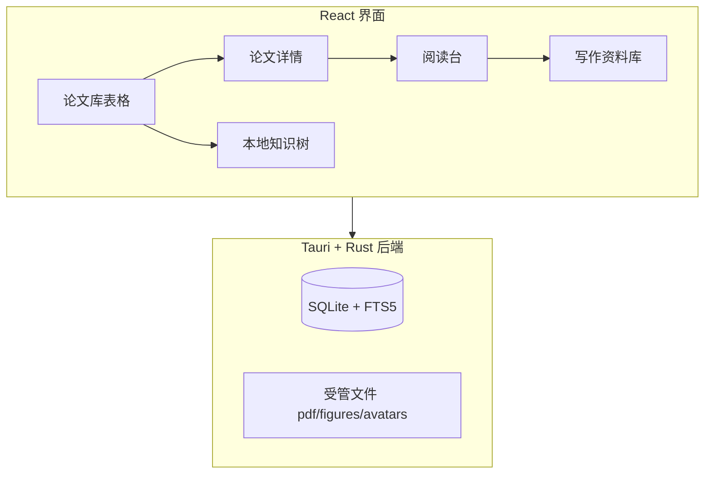
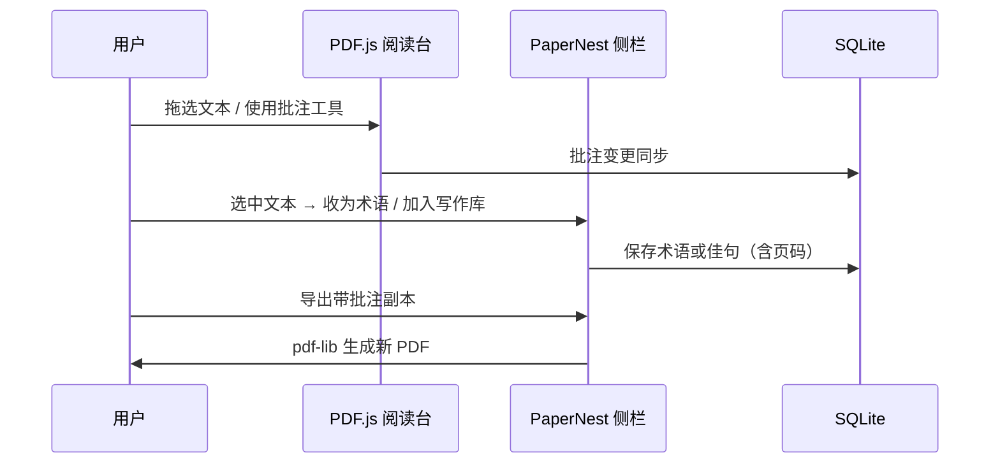
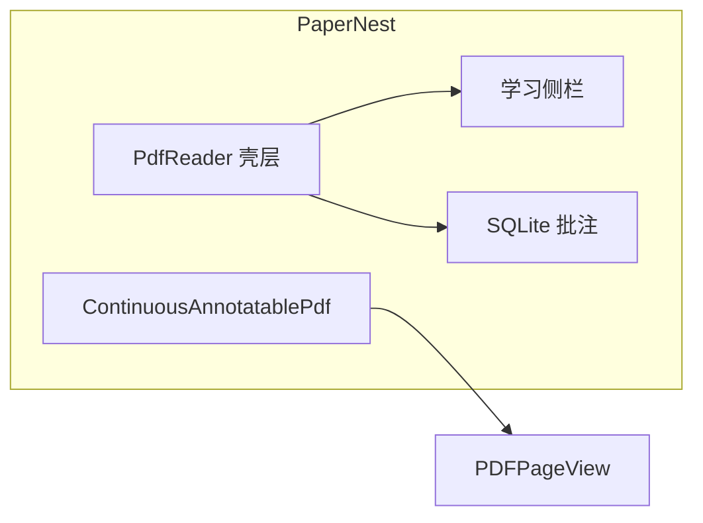

# PaperNest 本地论文库

> PaperNest 是面向计算机研究生的 Windows 本地论文管理工具。论文表格、PDF 阅读批注、术语学习、写作素材和本地知识树共用同一资料库；数据保存在本机，无账户与云同步。




## 快速开始

### 1. 首次启动

1. 安装并启动 PaperNest。新版 setup 若检测到本机已安装旧版，会提示升级/覆盖安装；**资料库目录** `PaperNestLibrary` **会保留**（卸载时不要勾选「删除应用数据」，否则会清掉路径配置）。
2. 首次启动默认在软件安装目录下创建 `PaperNestLibrary`（可在设置中迁移到其它位置）。资料库文件或目录不可写导致无法打开时，程序复制资料库到本机应用数据目录、切换路径，并在界面显示新路径。
3. 程序会在该目录创建 `library.db`、`pdf/originals`、`figures` 和 `backups`。不要手动移动其中的单个文件。


### 2. 导入与阅读

1. 在论文库右上角点击「导入 PDF」，选择一个或多个 PDF；也可导入 BibTeX/RIS。
2. 补充中英文标题、作者、领域、标签和一句话总结。
3. 单击论文打开右侧详情；双击或点击 PDF 图标进入阅读台。
4. 阅读台用 PDF.js 连续滚动阅读：普通滚轮上下翻页，**Ctrl + 滚轮**缩放，顶栏提供高亮、下划线、手绘等批注。


### 3. 批注与知识沉淀




1. 在阅读台顶栏切换高亮、下划线或手绘，再拖选文字批注。
2. 拖选英文词语或句子，使用浮动工具栏「收为术语」或「加入写作库」。加入写作库时可从下拉选择已有写作用途，也可新增类别。
3. 术语和佳句保留来源论文和页码，可从资料库跳回原文；中文优先用已配置 LLM 学术翻译，LibreTranslate 仅作弱回退。
4. 导出时生成带可见批注的新 PDF 副本，原始文件不修改。


### 4. 整理、备份与可选服务

- 使用领域、标签、阅读状态、保存视图和全局搜索定位论文。
- 勾选表格第一列可批量移入回收站；回收站中可恢复或永久删除。
- 定期在「设置」中创建完整备份。
- 需要翻译时，优先配置 LLM；本地 LibreTranslate 需先启动，并在设置中填写地址（可只填 `http://127.0.0.1:5000`）。


## 功能概览


| 模块    | 能力                                          |
| ----- | ------------------------------------------- |
| 论文库   | 表格检索、分类标签、保存视图、批量回收站、重复检测                   |
| 阅读台   | PDF.js 连续滚动、缩放、批注、撤销/重做                     |
| 学习侧栏  | 速览、批注列表、术语库、框架图（与阅读台同屏）                     |
| 写作资料库 | 英文原句、中文译文、用途标签、回到原文页码                       |
| 本地知识树 | 按领域/标签/文本相似度组织节点，双击定位论文                     |
| 任务日历  | 本地任务，可关联论文；页底阅读打卡（每日新增 + 满 5 分钟阅读）          |
| 可选辅助  | OCR、Crossref 元数据、LLM 导入分析、LibreTranslate 翻译 |


### 论文库

- 表格展示中英文标题、作者、状态、领域、标签、一句话总结、期刊/会议、日期和链接。
- Category 为单选主领域，Tags 为多选标签；可维护颜色、名称及合并关系。
- 支持内置视图、保存视图、排序、横向滚动、表格密度切换和全文搜索。
- 导入 PDF 后根据 DOI、arXiv 版本、文件哈希和标题提示已有相同文献；不同 arXiv 版本会作为历史版本交叉引用。
- 封面文本会填写英文摘要；CCS 分类树、LaTeX 残片和作者上标编号不会写入元数据。导入时封面与 LLM 共用一次 PDF.js 会话，避免同文件第一次解析残缺、第二次才正常。
- 论文库表格横向滚动时表头与勾选列同步；标题栏可手动刷新资料库。


### PDF 阅读与学习

阅读台采用 **pdfjs-dist** `PDFPageView` **+ PaperNest 学习侧栏**：




- 默认在应用右侧以 overlay 打开阅读台，从第 1 页起读。
- PDF.js 负责 canvas、文本层和高 DPI；PaperNest 负责缩放、批注 overlay 与 SQLite 持久化。
- 选中文本后可收录术语或写作佳句；OCR 与带批注导出由壳层处理。


### 资料沉淀

- 论文详情包含概览、双语摘要、术语/短语和方法框架图。
- 术语条目保存英文词语、中文释义、代表性原句、中文注释、页码和来源批注。
- 写作资料库保存英文原句、中文译文、写作用途、个人改写、标签和回到原文的页码。


### 导入、搜索与辅助能力

- 支持 PDF、BibTeX 和 RIS 导入；有文本层时建立页级全文索引。
- 扫描版 PDF 可执行本地 Tesseract OCR；无文本层状态会明确提示。
- Crossref 在线元数据补全：默认关闭；在设置中开启后，于论文详情手动「查找在线元数据」，逐字段确认写入。导入 PDF 时不会自动联网。
- 自定义元数据字段：在设置中定义字段类型，于论文详情填写；可选显示为论文库表格列。
- 可接入用户自己的大模型 API，对新导入论文提取双语题目、摘要、总结、术语和框架图候选。
- 任务与日历完全保存在本地，可关联论文。


## 资料库目录结构

```text
<软件安装目录>/PaperNestLibrary/   # 默认；迁移后为用户选定路径
├── library.db              # SQLite 主库（论文、批注、术语、任务等）
├── pdf/originals/          # 受管 PDF 原件
├── figures/                # 方法框架图
├── avatars/                # 用户头像
├── backups/                # 完整备份包
└── manifest.json           # 备份清单
```


## 翻译服务与换机

学术翻译优先使用已配置的 LLM。LibreTranslate 为可选弱回退。


| 方案                | 说明                                                                                                                         |
| ----------------- | -------------------------------------------------------------------------------------------------------------------------- |
| LLM（推荐）           | 设置 → LLM 自动整理；阅读台术语/写作句与导入中文字段按学术语体提示词翻译                                                                                   |
| 本地 LibreTranslate | 先 `scripts/setup-libretranslate.cmd` 安装，再用 `start-libretranslate.cmd` 启动；设置中填写 `http://127.0.0.1:5000`（会自动补全 `/translate`） |
| 模型路径              | `%LOCALAPPDATA%\PaperNest\LibreTranslate`（或仓库内 `.libretranslate-venv`）                                                     |
| 凭据存储              | LLM API Key 在 Windows 凭据管理器；翻译地址在本机 localStorage                                                                           |


## 开发与文档

```powershell
npm install
npm run dev          # 浏览器预览（localStorage 模拟后端）
npm run tauri dev    # 桌面端完整功能
npm run check        # 测试 + 构建
npm run tauri build  # 生成 paper-reader.exe 与 NSIS 安装包
Copy-Item src-tauri\target\release\paper-reader.exe release\windows\PaperNest.exe -Force
Copy-Item src-tauri\target\release\bundle\nsis\PaperNest_*_x64-setup.exe release\windows\ -Force
```


| 文档                                                           | 内容                                          |
| ------------------------------------------------------------ | ------------------------------------------- |
| [开发文档](docs/DEVELOPMENT.md)                                  | 架构分层、模块职责、批注同步流程、数据模型、视觉令牌、验证清单             |
| [界面风格](docs/UI_STYLE.md)                                     | 单一「主题」选项（经典工作台 / 柔光紫 / 雾蓝 / 苔绿暖黄 × 明暗）与视觉规范 |
| [更新记录](docs/CHANGELOG.md)                                    | 版本变更                                        |
| [扩展能力评估](docs/research/metadata-and-extension-assessment.md) | Crossref、Word/浏览器插件、PDF 边界                  |
