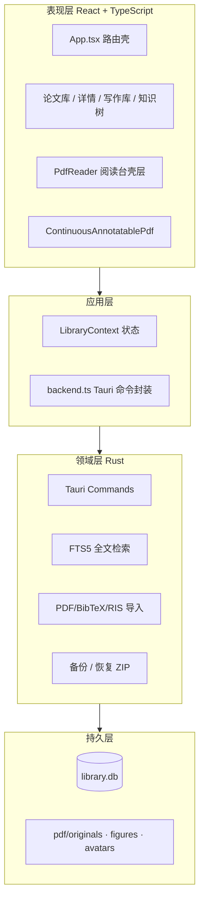
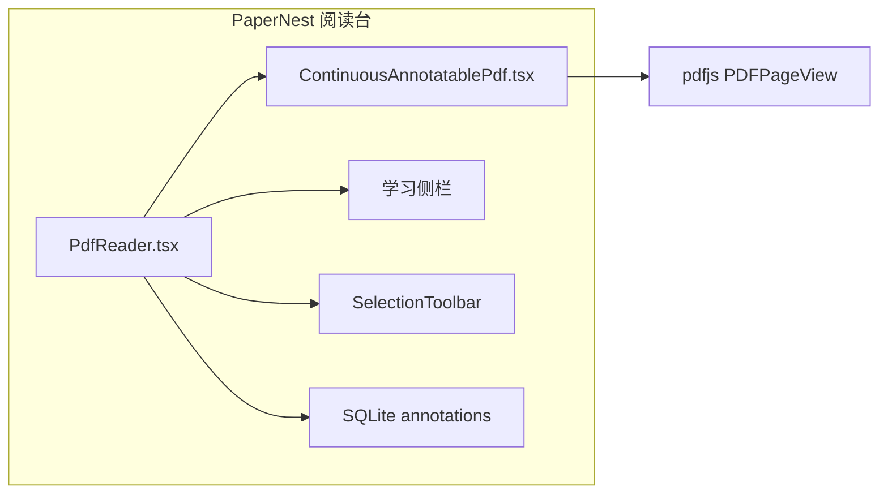
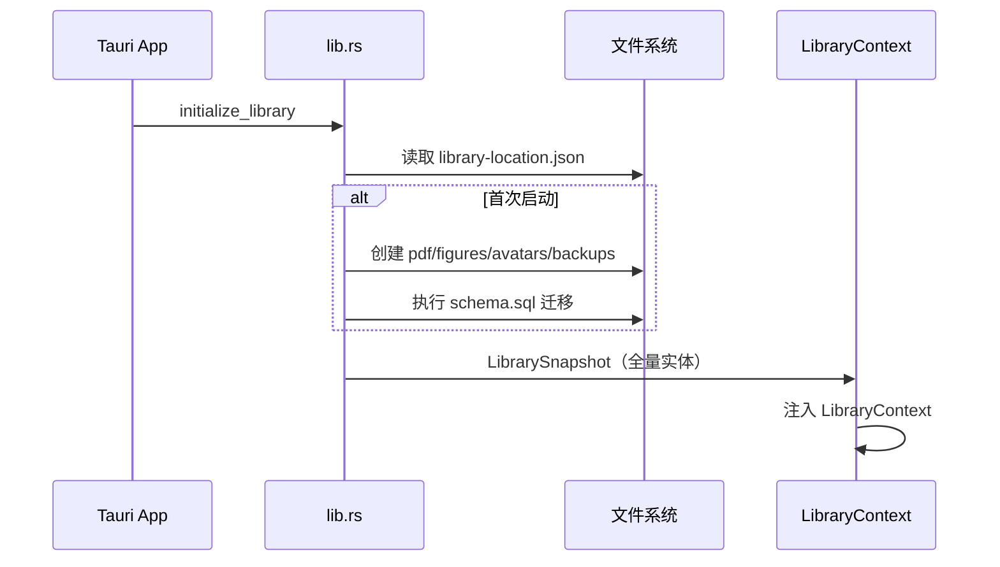
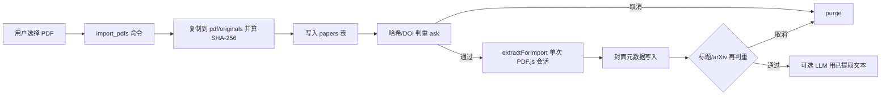
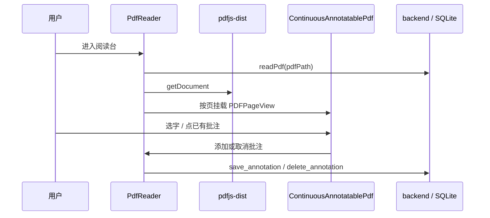
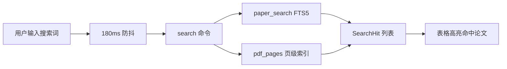
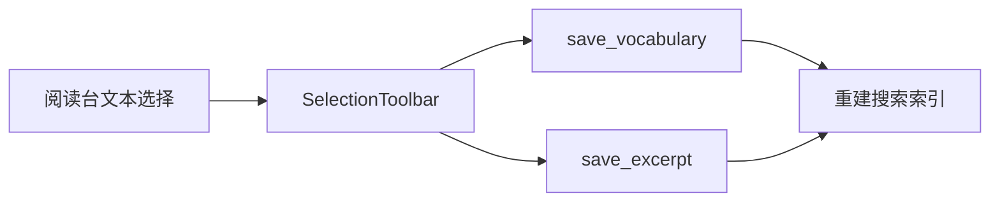
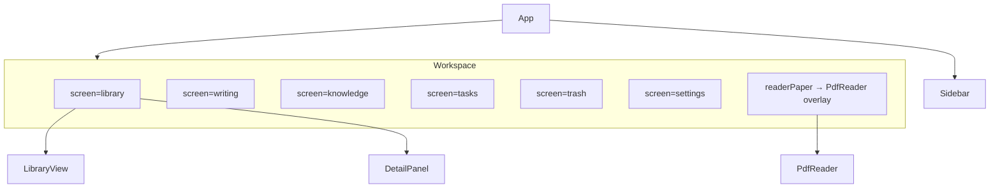

# PaperNest 开发文档

## 1. 产品边界

| 约束 | 说明 |
|------|------|
| 平台 | Windows 单机、单用户、本地优先 |
| V1 范围 | 本地资料库、PDF 阅读批注、术语与写作素材、任务日历、备份恢复 |
| 在线能力 | Crossref、LLM、翻译均由用户主动启用 |
| PDF 边界 | 原件只读；批注独立存储；导出时生成副本 |
| 阅读内核 | pdfjs-dist `PDFPageView` 连续阅读；PaperNest 负责批注 overlay、持久化与学习侧栏 |

---

## 2. 系统架构

### 2.1 分层总览



### 2.2 阅读台架构

阅读台由 **pdfjs-dist `PDFPageView`** 与 **PaperNest 壳层** 组成。PDF.js 负责 canvas、文本层和高 DPI；壳层负责缩放、批注 overlay、学习侧栏、术语/佳句、OCR 与导出。



| 组件 | 路径 | 职责 |
|------|------|------|
| `PdfReader` | `src/components/PdfReader.tsx` | 加载 PDF、缩放、工具模式、批注持久化、学习侧栏、OCR/导出 |
| `ContinuousAnnotatablePdf` | `src/components/ContinuousAnnotatablePdf.tsx` | 连续页 `PDFPageView`、批注 overlay、选区浮动条 |
| `SelectionToolbar` | `src/components/SelectionToolbar.tsx` | 高亮/下划线/批注切换、颜色、术语/佳句 |
| `AnnotationHistory` | `src/lib/annotationHistory.ts` | 批注撤销/重做 |
| `pdfRenderScale` | `src/lib/pdfRenderScale.ts` | 适应宽度/页面与 96/72 CSS 单位 |

---

## 3. 核心流程

### 3.1 应用启动与资料库初始化



- 资料库路径保存在 `%APPDATA%/.../library-location.json`，用户首次启动时选择。
- 若存在旧版默认路径 `PaperNestLibrary`，自动兼容。
- 浏览器预览模式（`npm run dev`）使用 `localStorage` 模拟后端，见 `backend.ts` 中 `isTauri()` 分支。

### 3.2 PDF 导入



- 导入仅复制文件，不修改原件。
- **同文件一好一坏的根因**：封面与 LLM 各开一次 PDF.js 时，`destroy` 后立刻再 `getDocument` 会与共享 worker 竞态。导入现走 `extractForImport`：一次打开同时得到封面与分析用正文；全局 `enqueuePdfWork` 保证打开串行，关闭用 `loadingTask.destroy()`。
- 封面读取文档 Info 与首页/次页文本，填写标题、作者、日期、英文摘要；单字拆开的 Abstract 会拼回单词，折行会拼成段落。
- 摘要在 `Keywords`、`Index Terms`、`CCS CONCEPTS`、`ACM Reference Format`、`Introduction`（含 `1 Introduction`、`II. INTRODUCTION`，以及 PDF.js 把小型大写拆成的 `1 I NTRODUCTION`）处截断；只含 CCS 分类树或 LaTeX 命令残片的文本不写入摘要。模板差异大时，学术界常用 GROBID，但它依赖独立服务，本机导入不捆绑。
- 已配置翻译服务时补中文摘要；已开启 LLM 自动整理时用同次提取的文本（vision 失败则纯文本重试）写回摘要/总结/术语，LLM 字段覆盖封面启发式。
- 扫描件或字段缺失时保留文件名，不编造；封面读取失败会出现在导入提示里。
- 文件哈希由 `import_pdfs` 在 Rust 侧写入。导入后先按哈希/DOI 判重（Tauri `ask`，能力清单需含 `dialog:allow-ask`），取消则 purge；通过后再读封面，读完再判一次标题/arXiv。同一 arXiv 稿的不同版本写入 `relatedPaperIds`。
- 论文库表格不使用 sticky。WebView2 中 sticky 表头与横向滚动会错位；`table-layout: fixed` + `colgroup` 固定列宽，整表同一滚动容器。
- 论文库标题栏提供「刷新」，调用 `initialize_library` 重载快照。

### 3.3 阅读台打开与批注同步



**同步规则：**

1. 批注几何以页面归一化坐标（0–1）写入 SQLite，overlay 按当前页 CSS 尺寸绘制。
2. 选区消失或点选区外时收起浮动条。已有高亮/下划线/批注不能叠层，需先取消。
3. 当前页由舞台顶部位置计算；打开后滚动钉在首页，直到用户自己滚动。

### 3.4 批注坐标系

PaperNest 在数据库中存储 **页面归一化坐标**（0–1，左上角原点）：

```json
{ "rects": [{ "x": 0.1, "y": 0.2, "width": 0.4, "height": 0.05 }] }
```

阅读台 overlay 使用同一套归一化坐标，按 `pageCssSize(viewport, scale)` 映射到 CSS 像素：

| 类型 | 绘制方式 |
|------|----------|
| `highlight` | 半透明矩形 |
| `underline` | 底边线 |
| `text` | 圆点标记 + 评论文本 |
| `ink` | 折线路径 |

### 3.5 全文搜索



- `rebuild_paper_search` 在论文、术语、佳句、批注变更后重建 FTS 文档。
- PDF 页级索引由 `index_pdf` 写入，OCR 完成后同样入库。

### 3.6 术语与写作佳句收录



- 文本层选区在 mouseup 时捕获；点选区外或选区折叠后收起浮动条。
- 收录时先走 LibreTranslate（若已配置）；不可用或失败则用已配置的 LLM（`translate_with_llm`）译成中文后写入术语释义 / 写作句译文。
- 「加入写作库」弹出写作用途对话框：下拉选择已有类别（含内置与历史自定义），或选「新增类别…」命名后保存。

### 3.7 备份与恢复

- `create_backup`：打包 `library.db`、受管 PDF、figures、avatars 为 ZIP，写入 `backups/`。
- `restore_backup`：解压到临时目录，校验后替换当前资料库。
- API Key、LibreTranslate 虚拟环境路径 **不** 进入备份包。

---

## 4. 目录结构

```text
paperReader/
├── src/
│   ├── App.tsx                 # 屏幕路由：library / writing / knowledge / tasks / trash / settings
│   ├── components/
│   │   ├── PdfReader.tsx                  # 阅读台壳层
│   │   ├── ContinuousAnnotatablePdf.tsx   # PDF.js 连续页 + 批注层
│   │   ├── LibraryView.tsx                # 论文表格 + 范围/状态/领域筛选
│   │   ├── FilterMenu.tsx                 # 带过渡的自定义筛选菜单
│   │   ├── DetailPanel.tsx                # 论文详情
│   │   └── ...
│   ├── lib/
│   │   ├── annotationHistory.ts
│   │   ├── annotationHit.ts
│   │   ├── paperDuplicate.ts
│   │   ├── pdfCoverMeta.ts
│   │   ├── pdfSession.ts                  # PDF.js 串行打开 / destroy
│   │   ├── extractPdfCover.ts             # 导入：单次会话封面+分析文本
│   │   └── pdfRenderScale.ts
│   ├── services/
│   │   ├── backend.ts          # Tauri invoke 统一入口
│   │   ├── translation.ts      # LibreTranslate 客户端
│   │   └── llm.ts              # LLM 分析
│   ├── state/
│   │   └── LibraryContext.tsx  # 全局资料库状态
│   └── types.ts                # 前后端共享类型（镜像 Rust 结构）
├── src-tauri/
│   ├── src/lib.rs              # Tauri 命令与 SQLite 逻辑
│   ├── src/online_metadata.rs  # Crossref 查询
│   └── schema.sql              # 数据库迁移
└── docs/
    ├── DEVELOPMENT.md          # 本文档
    ├── CHANGELOG.md
    └── research/
```

---

## 5. 数据模型

### 5.1 核心实体

| 实体 | 表 | 关键字段 |
|------|-----|----------|
| `Paper` | `papers` | 标题、作者、分类、标签、PDF 路径、阅读页码、`deletedAt` |
| `Annotation` | `annotations` | `paperId`、页码、类型、`geometry_json`、引文、颜色 |
| `VocabularyEntry` | `vocabulary` | 术语、释义、原句、页码 |
| `WritingExcerpt` | `excerpts` | 原句、译文、用途、标签 |
| `FrameworkFigure` | `figures` | 图片路径、页码、可选 geometry |
| `Task` | `tasks` | 截止日期、状态、关联论文 |

### 5.2 软删除与回收站

- 删除论文设置 `papers.deletedAt`，不立即删文件。
- 回收站永久删除才移除 PDF 与关联记录。
- 批注、术语、佳句通过 `paperId` 外键关联。

---

## 6. 主要 Tauri 命令

| 命令 | 用途 |
|------|------|
| `initialize_library` | 打开资料库，返回全量快照 |
| `save_paper` / `save_annotation` / … | 实体 CRUD |
| `import_pdfs` | 复制 PDF 并创建论文记录 |
| `read_pdf` | 读取受管 PDF 字节 |
| `index_pdf` / `indexed_pdf_pages` | 页级全文索引 |
| `ocr_page` | Tesseract OCR 单页 |
| `search` | FTS5 + PDF 页搜索 |
| `save_vocabulary` / `delete_vocabulary` | 术语增删 |
| `translate_text` / `translate_with_llm` | LibreTranslate；不可用时 LLM 英译中 |
| `save_excerpt` / `delete_excerpt` | 写作素材增改删；写作库卡片可改正用途 |
| `purge_paper` | 回收站论文永久删除（记录 + 受管文件） |
| `create_backup` / `restore_backup` | 备份恢复 |
| `lookup_online_metadata` | Crossref 元数据（可选） |

前端统一经 `src/services/backend.ts` 调用；类型定义与 Rust 结构体字段名一致（camelCase serde）。

---

## 7. 前端屏幕与组件关系



- 阅读台以 **fixed overlay** 覆盖工作区（`embedded` 模式），不占用独立路由。
- 左侧导航在阅读台打开时也会关闭 overlay；若本会话有批注或收录改动，先弹出保存确认。
- `Escape` 关闭阅读台（`App.tsx` 全局快捷键），同样走保存确认。

---

## 8. 依赖与技术栈

| 层次 | 技术 |
|------|------|
| 桌面壳 | Tauri 2 |
| UI | React 19 + TypeScript + Vite |
| 阅读 / 索引 | pdfjs-dist |
| 带批注导出 | pdf-lib |
| 数据库 | SQLite + SQLx + FTS5 |
| OCR | 本机 Tesseract |

阅读、全文索引和 OCR 渲染共用同一套 `pdfjs-dist` worker（Vite 打包路径）。

---

## 9. 本地开发

### 9.1 环境要求

- Node.js 18+
- Rust stable（Tauri 构建）
- Windows 10/11

### 9.2 常用命令

```powershell
npm install
npm run dev              # 浏览器预览（localStorage 后端）
npm run tauri dev        # 桌面端
npm run test             # Vitest
npm run build            # 前端生产构建
npm run tauri build      # 安装包
npm run check            # test + build
```

---

## 10. 验证清单

```powershell
node .\node_modules\typescript\bin\tsc -b
node .\node_modules\vitest\vitest.mjs run
node .\node_modules\vite\bin\vite.js build
cd src-tauri; cargo check
```

**桌面端功能回归：**

| 场景 | 预期 |
|------|------|
| 导入 PDF | 文件进入 `pdf/originals`，表格可见；英文摘要来自首页 Abstract，不含 Introduction / CCS LaTeX 残片；开启 LLM 时首次导入即有中文摘要/总结/术语 |
| 重复导入 | 同一文件弹出「重复文献」确认；取消后库中仍只有一篇；不同 arXiv 版本可同时存在并互相引用 |
| 论文库横向滚动 | 勾选框与各列表头、表体列宽一致，无叠影 |
| 论文库横向滚动 | 窗口非全屏时滚到最右并向下滚，表头整行吸顶，逐列与表体对齐 |
| 打开阅读台 | 从第 1 页起读，文本可选，Ctrl+滚轮与适应宽度/页面可反复切换 |
| 批注 | 高亮/下划线后 SQLite 有记录，重开仍显示 |
| 术语收录 | 选中文本 → 侧栏术语库有条目 |
| 搜索 | 标题、摘要、PDF 正文均可命中 |
| 备份恢复 | ZIP 可还原完整资料库 |
| 术语 / 写作库 | 单条或批量删除后列表更新 |
| 回收站 | 软删除可恢复，永久删除文件清除 |
| 阅读台跳转 | 无改动直接进入任务/写作库等；有改动先询问保存 |

---

## 11. 文本编码

所有源码和 Markdown 必须为 UTF-8。批量改写前先保留原文件，完成后检查 UTF-8 解码、替换字符 `U+FFFD` 与私有区异常字符。

---

## 12. 扩展方向

Crossref 元数据、Word/浏览器插件、PDF 正文编辑边界见 [metadata-and-extension-assessment.md](research/metadata-and-extension-assessment.md)。
