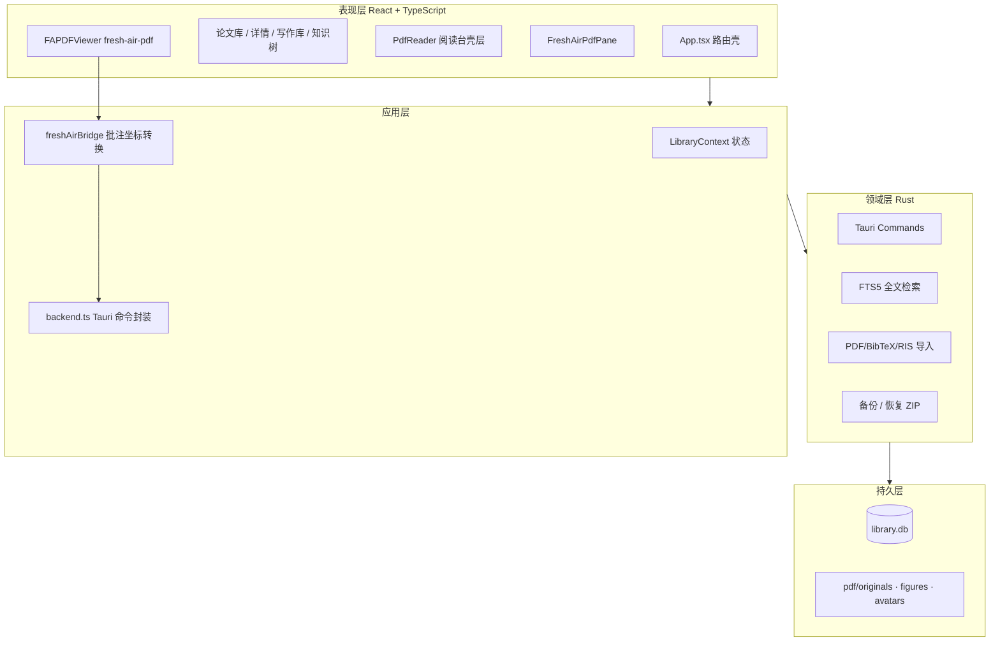
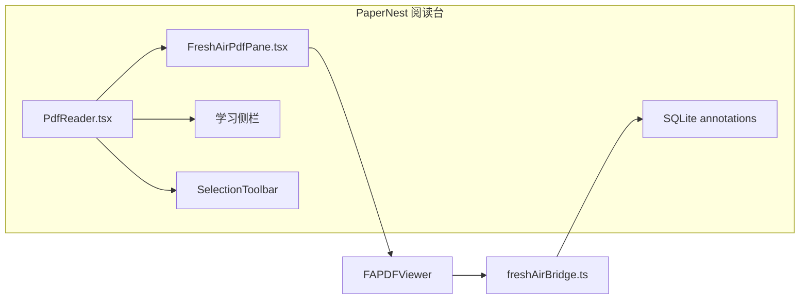
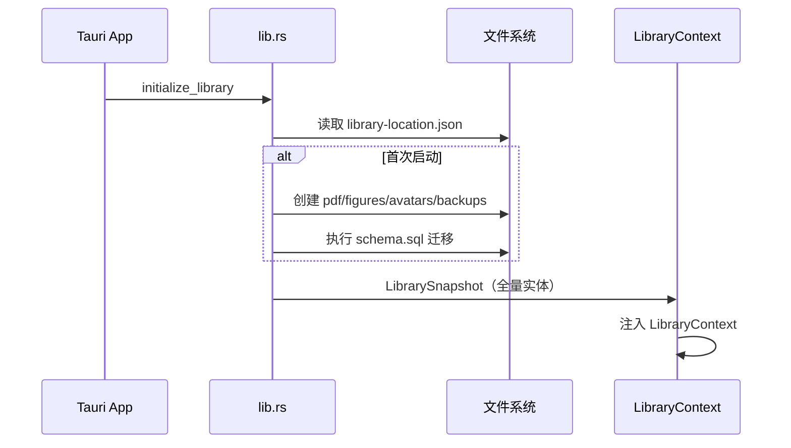
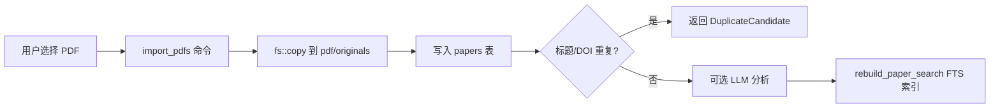
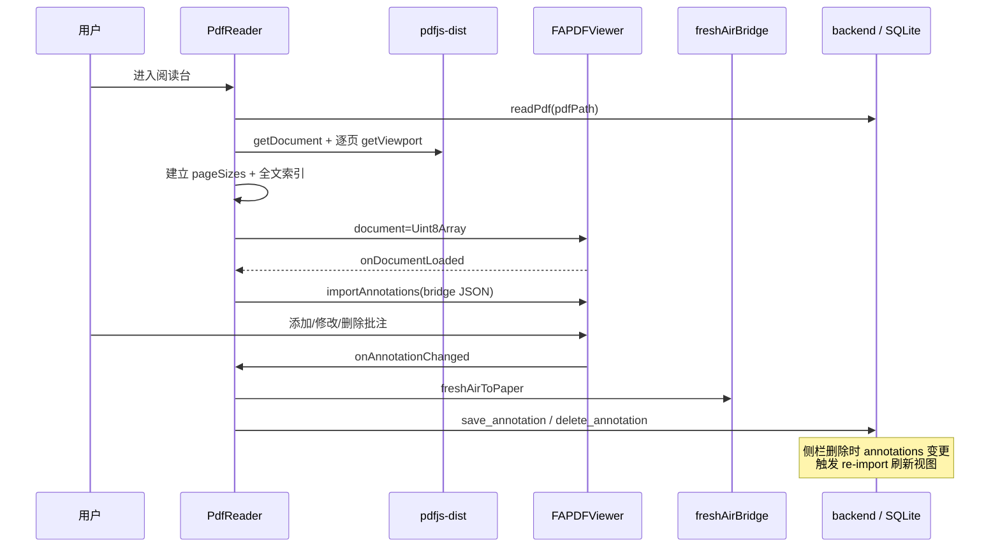
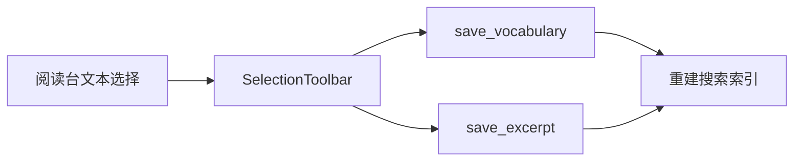
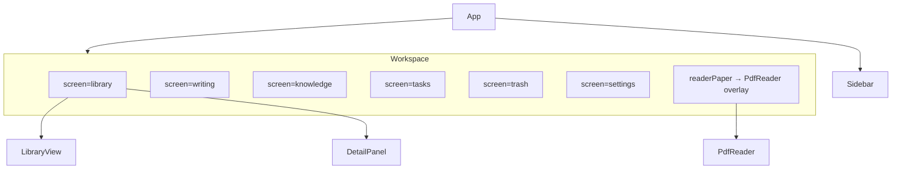

# PaperNest 开发文档

## 1. 产品边界

| 约束 | 说明 |
|------|------|
| 平台 | Windows 单机、单用户、本地优先 |
| V1 范围 | 本地资料库、PDF 阅读批注、术语与写作素材、任务日历、备份恢复 |
| 在线能力 | Crossref、LLM、翻译均由用户主动启用 |
| PDF 边界 | 原件只读；批注独立存储；导出时生成副本 |
| 阅读内核 | [Fresh Air PDF](https://github.com/VeARCTechnologies/FRESH-AIR-PDF)（MIT），PaperNest 负责持久化与学习侧栏 |

---

## 2. 系统架构

### 2.1 分层总览



### 2.2 阅读台架构（Fresh Air PDF 集成）

阅读台由 **Fresh Air PDF 内核** 与 **PaperNest 壳层** 组成。内核负责渲染与交互；壳层负责 SQLite 持久化、学习侧栏、术语/佳句收录、OCR 与导出。



| 组件 | 路径 | 职责 |
|------|------|------|
| `PdfReader` | `src/components/PdfReader.tsx` | 加载 PDF 字节、页尺寸、全文索引；挂载 Fresh Air；学习侧栏；OCR/导出 |
| `FreshAirPdfPane` | `src/components/FreshAirPdfPane.tsx` | 配置 `FAPDFViewer`（工具栏、缩略图、搜索、虚拟滚动） |
| `freshAirBridge` | `src/lib/freshAirBridge.ts` | PaperNest 归一化坐标 ↔ Fresh Air PDF 坐标双向映射 |
| `SelectionToolbar` | `src/components/SelectionToolbar.tsx` | 选中文本后的术语/佳句浮动菜单 |
| PDF Worker | `public/fresh-air-worker.mjs` | Fresh Air PDF 专用 worker（自 `fresh-air-pdf` 包复制） |

索引与页尺寸仍由 **pdfjs-dist** 在 `PdfReader` 加载阶段完成；渲染与批注交互完全交给 Fresh Air PDF。

---

## 3. 核心流程

### 3.1 应用启动与资料库初始化



- 资料库路径保存在 `%APPDATA%/.../library-location.json`，用户首次启动时选择。
- 若存在旧版默认路径 `PaperNestLibrary`，自动兼容。
- 浏览器预览模式（`npm run dev`）使用 `localStorage` 模拟后端，见 `backend.ts` 中 `isTauri()` 分支。

### 3.2 PDF 导入



- 导入仅复制文件，不修改原件。
- 重复检测依据 DOI 与标题匹配，不做文件哈希门禁。
- 导入后可选择运行 LLM 提取元数据（需用户配置 API）。

### 3.3 阅读台打开与批注同步



**同步规则：**

1. **SQLite → Fresh Air**：`annotations` 或 `updatedAt` 变化时，`FreshAirPdfPane` 调用 `importAnnotations`；`syncLock` 防止回环。
2. **Fresh Air → SQLite**：`onAnnotationChanged` 经 `freshAirToPaper` 写入；`action` 为 `added`/`modified`/`deleted`。
3. **阅读页码**：`onPageChanged` 更新 `papers.readingPage`。

### 3.4 批注坐标系

PaperNest 在数据库中存储 **页面归一化坐标**（0–1，左上角原点）：

```json
{ "rects": [{ "x": 0.1, "y": 0.2, "width": 0.4, "height": 0.05 }] }
```

Fresh Air PDF 使用 **PDF 页面点坐标**（viewport scale=1 的宽高）。`freshAirBridge` 在导入/导出时用 `pageSizes` 映射：

| PaperNest 类型 | Fresh Air 类型 | 映射方式 |
|----------------|----------------|----------|
| `highlight` | `Rectangle` + fillColor | 归一化 rect → PDF rect，半透明填充 |
| `underline` | `Underline` | 归一化 rect → quads |
| `text` | `FreeText` | rect + content |
| `ink` | `Ink` | 归一化 points → paths |

高亮在 Fresh Air 侧以半透明矩形渲染；用户在 Fresh Air 工具栏中创建的下划线、手绘等按上表写回 SQLite。

### 3.5 全文搜索


- `rebuild_paper_search` 在论文、术语、佳句、批注变更后重建 FTS 文档。
- PDF 页级索引由 `index_pdf` 写入，OCR 完成后同样入库。

### 3.6 术语与写作佳句收录



- 选择监听挂载在 `.fresh-air-stage` 容器上，mouseup 时读取 `window.getSelection()`。
- 可选调用 LibreTranslate（`translation.ts`）翻译后一并保存。

### 3.7 备份与恢复

- `create_backup`：打包 `library.db`、受管 PDF、figures、avatars 为 ZIP，写入 `backups/`。
- `restore_backup`：解压到临时目录，校验后替换当前资料库。
- API Key、LibreTranslate 虚拟环境路径 **不** 进入备份包。

---

## 4. 目录结构

```text
paperReader/
├── src/
│   ├── App.tsx                 # 屏幕路由：library / writing / knowledge / tasks / trash / settings
│   ├── components/
│   │   ├── PdfReader.tsx       # 阅读台壳层
│   │   ├── FreshAirPdfPane.tsx # Fresh Air PDF 封装
│   │   ├── LibraryView.tsx     # 论文表格 + 筛选
│   │   ├── DetailPanel.tsx     # 论文详情
│   │   └── ...
│   ├── lib/
│   │   └── freshAirBridge.ts   # 批注格式转换
│   ├── services/
│   │   ├── backend.ts          # Tauri invoke 统一入口
│   │   ├── translation.ts      # LibreTranslate 客户端
│   │   └── llm.ts              # LLM 分析
│   ├── state/
│   │   └── LibraryContext.tsx  # 全局资料库状态
│   └── types.ts                # 前后端共享类型（镜像 Rust 结构）
├── src-tauri/
│   ├── src/lib.rs              # Tauri 命令与 SQLite 逻辑
│   ├── src/online_metadata.rs  # Crossref 查询
│   └── schema.sql              # 数据库迁移
├── public/
│   └── fresh-air-worker.mjs    # Fresh Air PDF worker（npm install 后需存在）
└── docs/
    ├── DEVELOPMENT.md          # 本文档
    ├── CHANGELOG.md
    └── research/
```

---

## 5. 数据模型

### 5.1 核心实体

| 实体 | 表 | 关键字段 |
|------|-----|----------|
| `Paper` | `papers` | 标题、作者、分类、标签、PDF 路径、阅读页码、`deletedAt` |
| `Annotation` | `annotations` | `paperId`、页码、类型、`geometry_json`、引文、颜色 |
| `VocabularyEntry` | `vocabulary` | 术语、释义、原句、页码 |
| `WritingExcerpt` | `excerpts` | 原句、译文、用途、标签 |
| `FrameworkFigure` | `figures` | 图片路径、页码、可选 geometry |
| `Task` | `tasks` | 截止日期、状态、关联论文 |

### 5.2 软删除与回收站

- 删除论文设置 `papers.deletedAt`，不立即删文件。
- 回收站永久删除才移除 PDF 与关联记录。
- 批注、术语、佳句通过 `paperId` 外键关联。

---

## 6. 主要 Tauri 命令

| 命令 | 用途 |
|------|------|
| `initialize_library` | 打开资料库，返回全量快照 |
| `save_paper` / `save_annotation` / … | 实体 CRUD |
| `import_pdfs` | 复制 PDF 并创建论文记录 |
| `read_pdf` | 读取受管 PDF 字节 |
| `index_pdf` / `indexed_pdf_pages` | 页级全文索引 |
| `ocr_page` | Tesseract OCR 单页 |
| `search` | FTS5 + PDF 页搜索 |
| `create_backup` / `restore_backup` | 备份恢复 |
| `lookup_online_metadata` | Crossref 元数据（可选） |

前端统一经 `src/services/backend.ts` 调用；类型定义与 Rust 结构体字段名一致（camelCase serde）。

---

## 7. 前端屏幕与组件关系



- 阅读台以 **fixed overlay** 覆盖工作区（`embedded` 模式），不占用独立路由。
- `Escape` 关闭阅读台（`App.tsx` 全局快捷键）。

---

## 8. 依赖与技术栈

| 层次 | 技术 |
|------|------|
| 桌面壳 | Tauri 2 |
| UI | React 19 + TypeScript + Vite |
| 阅读内核 | fresh-air-pdf（基于 PDF.js） |
| 索引 / 页尺寸 | pdfjs-dist |
| 带批注导出 | pdf-lib |
| 数据库 | SQLite + SQLx + FTS5 |
| OCR | 本机 Tesseract |

**双 PDF.js 说明：** 项目同时依赖 `pdfjs-dist`（索引、OCR 渲染）与 `fresh-air-pdf` 内置的 PDF.js（阅读渲染）。二者 worker 分离：`pdfjs-dist` 走 Vite 打包路径，Fresh Air 使用 `public/fresh-air-worker.mjs`。

---

## 9. 本地开发

### 9.1 环境要求

- Node.js 18+
- Rust stable（Tauri 构建）
- Windows 10/11

### 9.2 常用命令

```powershell
npm install
npm run dev              # 浏览器预览（localStorage 后端）
npm run tauri dev        # 桌面端
npm run test             # Vitest
npm run build            # 前端生产构建
npm run tauri build      # 安装包
npm run check            # test + build
```

### 9.3 Fresh Air PDF Worker

`fresh-air-pdf` 的 worker 未通过 npm exports 暴露，需复制到 `public/`：

```powershell
Copy-Item node_modules/fresh-air-pdf/dist/pdf.worker.min.mjs public/fresh-air-worker.mjs
```

`npm install` 后若该文件缺失，阅读台无法加载 PDF。

---

## 10. 验证清单

```powershell
node .\node_modules\typescript\bin\tsc -b
node .\node_modules\vitest\vitest.mjs run
node .\node_modules\vite\bin\vite.js build
cd src-tauri; cargo check
```

**桌面端功能回归：**

| 场景 | 预期 |
|------|------|
| 导入 PDF | 文件进入 `pdf/originals`，表格可见 |
| 打开阅读台 | Fresh Air 工具栏、缩略图、Ctrl+滚轮缩放正常 |
| 批注 | 高亮/下划线后 SQLite 有记录，重开仍显示 |
| 术语收录 | 选中文本 → 侧栏术语库有条目 |
| 搜索 | 标题、摘要、PDF 正文均可命中 |
| 备份恢复 | ZIP 可还原完整资料库 |
| 回收站 | 软删除可恢复，永久删除文件清除 |

---

## 11. 文本编码

所有源码和 Markdown 必须为 UTF-8。批量改写前先保留原文件，完成后检查 UTF-8 解码、替换字符 `U+FFFD` 与私有区异常字符。

---

## 12. 扩展方向

Crossref 元数据、Word/浏览器插件、PDF 正文编辑边界见 [metadata-and-extension-assessment.md](research/metadata-and-extension-assessment.md)。
