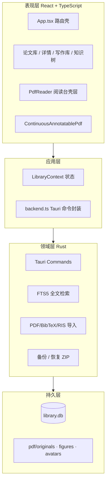
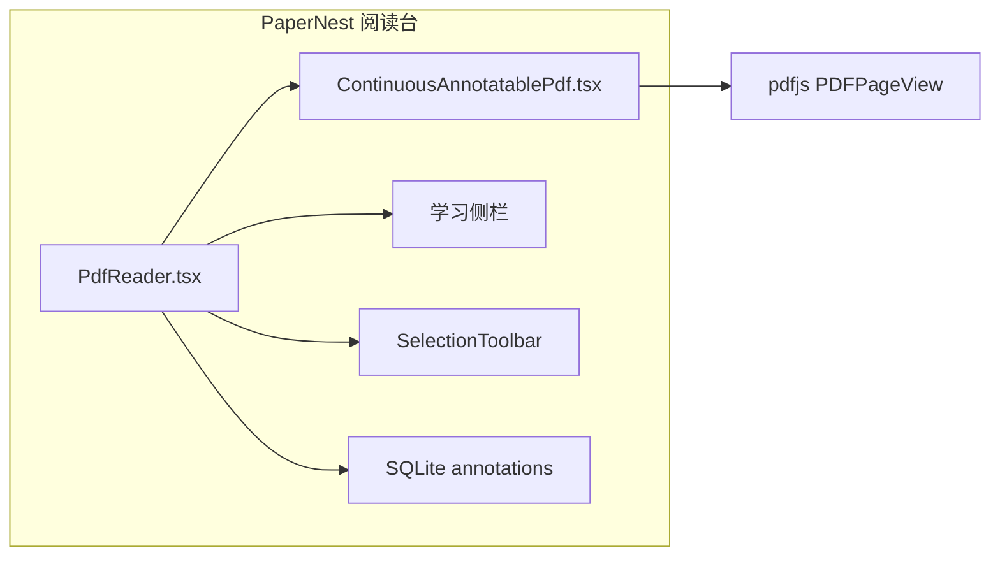
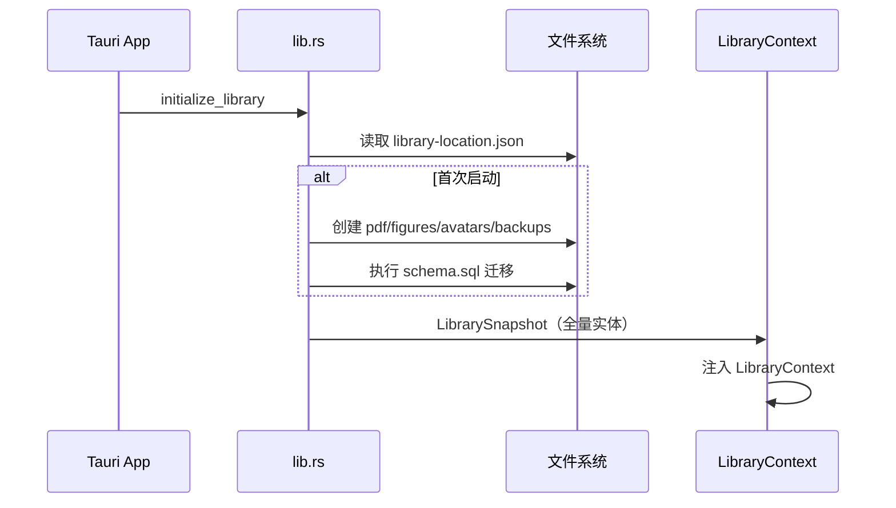
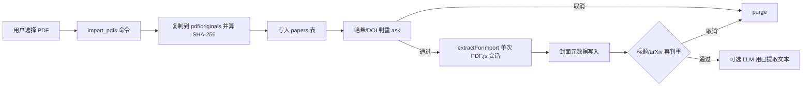
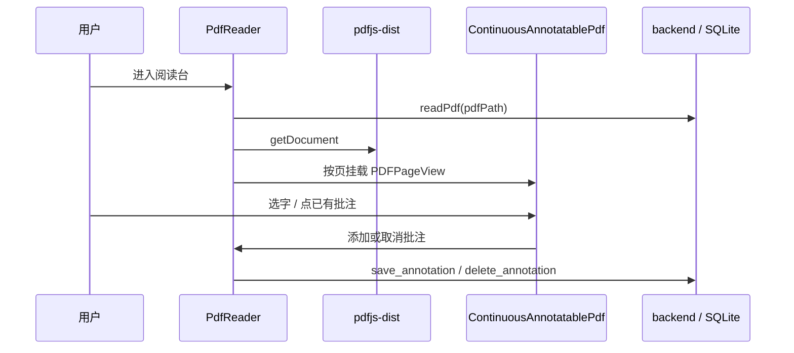
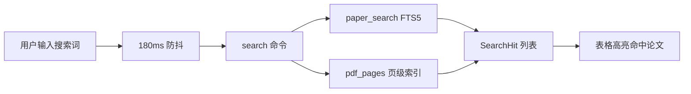
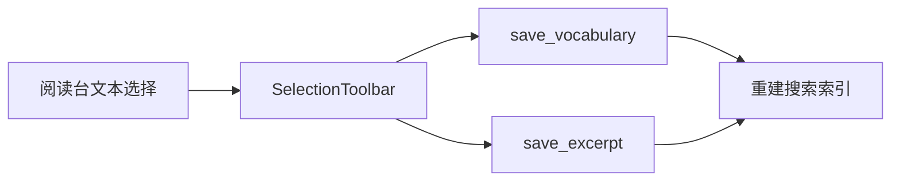
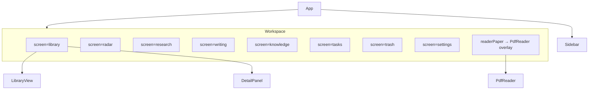

# PaperNest 开发文档

## 1. 产品边界

| 约束 | 说明 |
|------|------|
| 平台 | Windows 单机、单用户、本地优先 |
| 资料库位置 | 默认本地磁盘。SQLite 使用 `DELETE` journal。数据库文件或目录不可写导致打开失败时，复制到本机应用数据目录、更新路径配置，并在界面提示新路径 |
| V1 范围 | 本地资料库、PDF 阅读批注、术语与写作素材、任务日历、备份恢复 |
| 在线能力 | Crossref、论文雷达、LLM、翻译均由用户主动启用 |
| PDF 边界 | 原件只读；批注独立存储；导出时生成副本；雷达发现期不下 PDF |
| 阅读内核 | pdfjs-dist `PDFPageView` 连续阅读；PaperNest 负责批注 overlay、持久化与学习侧栏 |

---

## 2. 系统架构

### 2.1 分层总览



### 2.2 阅读台架构

阅读台由 **pdfjs-dist `PDFPageView`** 与 **PaperNest 壳层** 组成。PDF.js 负责 canvas、文本层和高 DPI；壳层负责缩放、批注 overlay、学习侧栏、术语/佳句、OCR 与导出。



| 组件 | 路径 | 职责 |
|------|------|------|
| `PdfReader` | `src/components/PdfReader.tsx` | 加载 PDF、缩放、工具模式、批注持久化、学习侧栏、OCR/导出 |
| `ContinuousAnnotatablePdf` | `src/components/ContinuousAnnotatablePdf.tsx` | 连续页 `PDFPageView`、批注 overlay、选区浮动条 |
| `SelectionToolbar` | `src/components/SelectionToolbar.tsx` | 高亮/下划线/批注切换、颜色、术语/佳句 |
| `AnnotationHistory` | `src/lib/annotationHistory.ts` | 批注撤销/重做 |
| `pdfRenderScale` | `src/lib/pdfRenderScale.ts` | 适应宽度/页面与 96/72 CSS 单位 |

---

## 3. 核心流程

### 3.1 应用启动与资料库初始化



- 资料库路径优先读取 `%APPDATA%/.../library-location.json`（用户迁移后的设定）。
- 若无自定义路径：已存在的旧版 `%LocalAppData%/.../PaperNestLibrary`、「文档/PaperNestLibrary」或**安装目录旁**已有 `library.db` 的 `PaperNestLibrary` 继续沿用，并写入 `library-location.json`；否则默认使用软件安装目录下的 `PaperNestLibrary`。
- 打开失败且 `library.db` 或资料库目录不可写时，复制到 `%LocalAppData%/.../PaperNestLibrary-recovered-*`，更新路径配置，快照字段 `libraryNotice` 携带新路径说明。
- 同一 `identifier` 的 NSIS setup 可检测旧版并覆盖安装；`PaperNestLibrary` 不在卸载清单内，升级后仍加载原资料库（卸载时勿勾选删除应用数据，否则会清掉配置指针）。
- 浏览器预览模式（`npm run dev`）使用 `localStorage` 模拟后端，见 `backend.ts` 中 `isTauri()` 分支。
- 按需加载页面由 `LazyScreenBoundary` 包裹；模块请求失败时显示重新加载入口。

### 3.2 PDF 导入



- 导入仅复制文件，不修改原件。当前选中真实文件夹时写入 `folder_id`；在「全部」或「未归档」下导入则 `folder_id` 为空。
- 封面与 LLM 共用 `extractForImport` 单次 PDF.js 会话；`enqueuePdfWork` 串行打开，`loadingTask.destroy()` 关闭。
- 封面读取文档 Info 与首页/次页文本，填写标题、作者、日期、英文摘要；单字拆开的 Abstract 会拼回单词，折行会拼成段落。
- 双栏首页按文本 x 的最大空隙分栏：优先在 Abstract 下方正文字号内测中缝。Abstract 仅在一侧时只取该列；正文首行跨中缝且为连字符折行时保留全宽；右栏 Index Terms 上方出现小写短尾时按「左栏全文 + 右栏短尾」拼接（IEEE TKDE 常见）。
- 摘要只用第 1 页 runs。同栏折行连字符与摘要区 drop-cap 在聚类时拼回；标题只在 Abstract 以上选取，忽略摘要超大号首字母。
- 刊名：会议缩写匹配时 `WWW` 须带年份；IEEE DOI（如 `10.1109/TKDE…`）映射为 `IEEE TKDE` 等。
- 摘要在 `Keywords`、`Index Terms`、`CCS CONCEPTS`、`ACM Reference Format`、`Introduction`（含 `1 Introduction`、`II. INTRODUCTION`，以及 PDF.js 把小型大写拆成的 `1 I NTRODUCTION`）处截断；只含 CCS 分类树或 LaTeX 命令残片的文本不写入摘要。模板差异大时，学术界常用 GROBID，但它依赖独立服务，本机导入不捆绑。
- 封面提取同时写入 PDF 页数。
- 已配置翻译服务时补中文摘要；已开启 LLM 自动整理时用同次提取的文本（默认纯文本）写回摘要/总结/术语；若仍缺总结或术语，再用标题+摘要做一次轻量补全。LLM 字段覆盖封面启发式。
- 开启「导入时自动分类」时，在元数据分析之后调用 `classify_paper_taxonomy`：从当前 `categories`/`tags` 词表选主领域（≤1）与子领域标签；严格度控制标签数量；无法匹配则弃权并保持未分类。向尚无分类的论文写入分类结果。
- LLM「测试连接」先写入当前设置；写入失败时不发起连接请求，测试结束前保持按钮禁用。
- 导入进度与完成提示存在 `LibraryContext`：切换离开论文库再回来仍显示；其他界面顶部有导入横幅，直到本次导入结束。
- PDF、Bib/RIS 导入失败时刷新资料库快照，并在顶部显示错误；导入期间禁用两个导入按钮与新建论文按钮。
- 顶部 Bib/RIS 导入入口在 1280px 宽度下保持可见。
- 论文详情的框架图读取失败时在图片位置显示错误，便于定位丢失或不可访问的受管文件。
- 扫描件或字段缺失时保留文件名，不编造；封面读取失败会出现在导入提示里。
- 文件哈希由 `import_pdfs` 在 Rust 侧写入。导入后先按哈希/DOI 判重（Tauri `ask`，能力清单需含 `dialog:allow-ask`），取消则 purge；通过后再读封面，读完再判一次标题/arXiv。同一 arXiv 稿的不同版本写入 `relatedPaperIds`。
- 论文库「打开原文」通过 Rust `open_external_url` 用系统默认浏览器打开；无 `sourceUrl` 时可用 DOI / arXiv 拼落地页（WebView 内 `window.open` 无效）。
- 论文库表格不使用 sticky。WebView2 中 sticky 表头与横向滚动会错位；`table-layout: fixed` + `colgroup` 固定列宽，整表同一滚动容器。
- 论文库标题栏提供「刷新」，调用 `initialize_library` 重载快照。
- 右侧论文详情左侧可拖动调宽（宽度写入 localStorage）；面板变窄时双语摘要经 container query 改为单列。

### 3.3 阅读台打开与批注同步



**同步规则：**

1. 批注几何以页面归一化坐标（0–1）写入 SQLite，overlay 按当前页 CSS 尺寸绘制。
2. 选区消失或点选区外时收起浮动条。已有高亮/下划线/批注不能叠层，需先取消。
3. 当前页由舞台顶部位置计算；打开后滚动钉在首页，直到用户自己滚动。

### 3.4 本地知识树

知识树对齐 [Connected Papers](https://www.connectedpapers.com/about/) 的**交互与视觉模型**；当前底层为 **L1 本地语义**（未接引文 API）。
「在论文表格中定位」与双击节点：切换到论文库、清空搜索、选中论文所在文件夹（或未归档），表格选中行高亮并滚入可视区。

| Connected Papers | PaperNest（L1） |
|------------------|-----------------|
| Semantic Scholar 上约 5 万候选 | 本机库邻域（最多约 40 篇） |
| 共引 + 文献耦合 | **BM25（对称）65% + TF-IDF 余弦 35%**；标题字段加倍；中文二字切分；再加标签 Jaccard / 同领域 / `relatedPaperIds` |
| 力导向；选中高亮到原点最短路径 | 同左 |
| 颜色=年份、大小=引用量 | 颜色=年份；大小=局部关联强度 |

流程：原点（默认平均相似度最高）→ 邻域 → **稀疏** kNN(k=2)+MST 建边 → 力导向（**随节点数自适应**画布面积、电荷、碰撞垫、理想边长、迭代次数）。阈值过滤弱边；滤光时保留骨架边。

**为何先做 L1：** 不依赖 DOI/外网，小库即可出边；BM25 比纯词袋重叠更偏「检索相关」。后续可选 L2（OpenAlex/S2 共引缓存）叠加权。

实现：`src/lib/knowledgeGraph.ts`、`KnowledgeGraphInteractive.tsx`。

### 3.5 批注坐标系

PaperNest 在数据库中存储 **页面归一化坐标**（0–1，左上角原点）：

```json
{ "rects": [{ "x": 0.1, "y": 0.2, "width": 0.4, "height": 0.05 }] }
```

阅读台 overlay 使用同一套归一化坐标，按 `pageCssSize(viewport, scale)` 映射到 CSS 像素：

| 类型 | 绘制方式 |
|------|----------|
| `highlight` | 半透明矩形 |
| `underline` | 底边线 |
| `text` | 圆点标记 + 评论文本 |
| `ink` | 折线路径 |

### 3.6 全文搜索



- `rebuild_paper_search` 在论文、术语、佳句、批注变更后重建 FTS 文档。
- PDF 页级索引由 `index_pdf` 写入，OCR 完成后同样入库。
- `search_library` 失败时前端显示全文索引错误，标题、作者等本地匹配继续可用。

### 3.7 术语与写作佳句收录



- 文本层选区在 mouseup 时捕获；点选区外或选区折叠后收起浮动条。
- 收录时用已配置的 LLM 做学术翻译（术语释义与句子翻译分提示词，并带页内上下文）；可配置 LibreTranslate 提供本地翻译。
- 「加入写作库」弹出写作用途对话框：下拉选择已有类别（含内置与历史自定义），或选「新增类别…」命名后保存。
- LibreTranslate 需先运行 `scripts/start-libretranslate.cmd`；设置里可填 `http://127.0.0.1:5000`（自动补全 `/translate`）。

### 3.8 备份与恢复

- `create_backup`：打包 `library.db`、受管 PDF、figures、avatars 为 ZIP，写入 `backups/`。
- `restore_backup`：解压到相邻临时目录，校验后清理当前资料库（保留 `backups/`）再写入。
- 启动时若 `library.db` 或资料库目录不可写，复制到应用数据目录、更新路径配置，并通过 `libraryNotice` 在界面提示新路径。
- 启动迁移会删除临床医学临时包残留的分类/标签 ID，并清理论文上的对应引用。
- 资料库迁移、创建备份、恢复备份失败时，在设置页显示具体错误。
- 个人资料保存失败时，在设置页显示具体错误。
- API Key、LibreTranslate 虚拟环境路径 **不** 进入备份包。

---

## 4. 目录结构

```text
paperReader/
├── src/
│   ├── App.tsx                 # 屏幕路由：library / radar / research / writing / knowledge / tasks / trash / settings
│   ├── components/
│   │   ├── PdfReader.tsx                  # 阅读台壳层
│   │   ├── ContinuousAnnotatablePdf.tsx   # PDF.js 连续页 + 批注层
│   │   ├── LibraryView.tsx                # 论文表格 + 范围/状态/领域筛选
│   │   ├── FilterMenu.tsx                 # 带过渡的自定义筛选菜单
│   │   ├── DetailPanel.tsx                # 论文详情
│   │   └── ...
│   ├── lib/
│   │   ├── annotationHistory.ts
│   │   ├── annotationHit.ts
│   │   ├── paperDuplicate.ts
│   │   ├── pdfCoverMeta.ts
│   │   ├── pdfSession.ts                  # PDF.js 串行打开 / destroy
│   │   ├── extractPdfCover.ts             # 导入：单次会话封面+分析文本
│   │   └── pdfRenderScale.ts
│   ├── services/
│   │   ├── backend.ts          # Tauri invoke 统一入口
│   │   ├── translation.ts      # LibreTranslate 客户端
│   │   └── llm.ts              # LLM 分析
│   ├── components/
│   │   └── research/           # ResearchView 等
│   ├── research-harness/       # Phase 9：DSH session 桥接（bootstrap、sessionBridge）
│   ├── state/
│   │   └── LibraryContext.tsx  # 全局资料库状态
│   └── types.ts                # 前后端共享类型（镜像 Rust 结构）
├── src-tauri/
│   ├── src/lib.rs              # Tauri 命令与 SQLite 逻辑
│   ├── src/online_metadata.rs  # Crossref 查询
│   ├── src/radar.rs            # 论文雷达（radar.db）
│   ├── src/research.rs         # 文献调研会话与命令（含多轮 continue/export）
│   ├── src/research_turns.rs   # turns.jsonl 轮次记录 + 附件存储/多模态注入
│   ├── src/research_web.rs     # fetch_url 网页正文抓取
│   ├── src/research_tools.rs   # 工具层 + SourceCollector（MCP 共用，含 fetch_url）
│   ├── src/research_react.rs   # ReAct 主循环
│   ├── src/research_reviewer.rs
│   ├── src/research_subagent.rs
│   ├── src/research_writer.rs
│   ├── src/research_llm.rs     # 调研 LLM 客户端（瞬时网络错误有界重试）
│   ├── src/mcp_server.rs       # MCP Server（stdio JSON-RPC）
│   └── src/bin/papernest_mcp.rs
│   └── schema.sql              # 数据库迁移
└── docs/
    ├── DEVELOPMENT.md          # 本文档
    ├── CHANGELOG.md
    └── research/
```

---

## 5. 数据模型

### 5.1 核心实体

| 实体 | 表 | 关键字段 |
|------|-----|----------|
| `Paper` | `papers` | 标题、作者、主领域（`categoryId`，单选）、子领域标签（`tagIds`，多选）、PDF 路径、阅读页码、`deletedAt` |
| `Annotation` | `annotations` | `paperId`、页码、类型、`geometry_json`、引文、颜色 |
| `VocabularyEntry` | `vocabulary` | 术语、释义、原句、页码 |
| `WritingExcerpt` | `excerpts` | 原句、译文、用途、标签 |
| `FrameworkFigure` | `figures` | 图片路径、页码、可选 geometry |
| `Task` | `tasks` | 截止日期、状态、关联论文 |
| `Folder` | `folders` | 名称、`parent_id`、排序；可嵌套 |
| `Paper.folderId` | `papers.folder_id` | 每篇至多一个文件夹；`NULL` 为未归档 |

### 5.2 主领域与子领域预设

- **主领域**（`categories`）：16 个中文预设，对齐 [ACM CCS 2012](https://www.acm.org/publications/class-2012) 顶层概念，并将「计算方法」中国内常用的 CV / NLP / ML / 推荐等拆成独立主领域，便于论文库单选。
- **子领域**（`tags`）：31 个可多选标签（方法、任务、阅读用途）。设置页可继续增删改。
- 启动时 `schema.sql` 对预设执行 `INSERT OR IGNORE`，已有资料库自动补全缺失项，保留用户自建名称。

### 5.3 文件夹

- 逻辑分组：移动论文只改 `folder_id`，不搬 `pdf/originals` 下的文件。
- 删除：子树内存在未软删论文时拒绝；空子文件夹不挡删除，随父级 CASCADE 删除。
- 软删论文保留 `folder_id`；删文件夹时对仍挂在子树的软删论文置空 `folder_id`。
- schema_version = 5；旧库启动时 `ALTER TABLE papers ADD COLUMN folder_id` 后再建索引。

### 5.4 软删除与回收站

- 删除论文设置 `papers.deletedAt`，软删除并保留文件至永久删除。
- 回收站永久删除才移除 PDF 与关联记录。
- 批注、术语、佳句通过 `paperId` 外键关联。

---

## 6. 主要 Tauri 命令

| 命令 | 用途 |
|------|------|
| `initialize_library` | 打开资料库，返回全量快照 |
| `save_paper` / `save_annotation` / … | 实体 CRUD |
| `save_folder` / `delete_folder` | 文件夹增改删（非空拒绝） |
| `move_papers_to_folder` | 批量设置论文 `folder_id` |
| `import_pdfs` | 复制 PDF 并创建论文记录；可选 `folder_id` |
| `read_pdf` | 读取受管 PDF 字节 |
| `index_pdf` / `indexed_pdf_pages` | 页级全文索引 |
| `ocr_page` | Tesseract OCR 单页 |
| `search` | FTS5 + PDF 页搜索 |
| `save_vocabulary` / `delete_vocabulary` | 术语增删 |
| `save_figure` / `delete_figure` | 方法框架图增删（删除时清除图片文件） |
| `translate_text` / `translate_with_llm` | LibreTranslate；不可用时 LLM 英译中 |
| `classify_paper_taxonomy` | 按现有词表为论文选主领域/子领域；弃权时返回空分类 |
| `save_excerpt` / `delete_excerpt` | 写作素材增改删；写作库卡片可改正用途 |
| `purge_paper` | 回收站论文永久删除（记录 + 受管文件） |
| `create_backup` / `restore_backup` | 备份恢复 |
| `lookup_online_metadata` | Crossref 元数据（设置开启 + 论文详情手动触发） |
| `radar_get_settings` / `radar_save_settings` | 论文雷达开关与订阅类目（独立 `radar.db`） |
| `radar_fetch_today` | 用户点击后三路召回 Hot + New(+日窗) + Interest(关键词)；发现期只写元数据 |
| `radar_import_to_library` | 加入资料库；可选下载 PDF，或仅元数据 |
| `radar_list_feed` / `radar_recommend` / `radar_week_hot` | 三榜（Hot/New/Interest）、推荐 cascade + 可选 embedding rerank、近 7 日热点 |
| `radar_explain_paper` / `radar_get_explanation` / `radar_list_explained_ids` / `radar_delete_explanation` | 单篇解读生成/读缓存/列出已解读/删缓存 |
| `research_get_settings` / `research_save_settings` / `research_test_connection` | 文献调研开关与独立 LLM |
| `research_create_session` / `research_list_sessions` / `research_get_session` | 调研任务 CRUD |
| `research_run_session` | 运行 Agent；事件经 `research_dsh_append` 写入 `.dsh-session/` |
| `research_list_turns` / `research_read_sources` / `research_list_steps` | 读多轮答复与过程投影 |
| `research_continue_session` / `research_export_report` | 单窗口追问开新一轮 / 合并各轮为 `report-full.md` |
| `research_dsh_append` / `research_dsh_derive_messages` / `research_dsh_load` | Phase 9：DSH Session 桥接 |
| `research_dsh_fork` / `research_resume_session` | Phase 9：官方 `SessionStore.fork` + Rust 续跑 |
| `research_open_workspace` / `research_delete_session` | 打开文件夹 / 删除任务 |
| `save_online_metadata_settings` | 在线元数据开关与联系邮箱 |
| `save_paper_custom_field_values` | 保存单篇论文的自定义字段值 |
| `save_custom_field_definition` | 新增或更新字段定义 |
| `archive_custom_field_definition` | 归档字段定义 |

前端统一经 `src/services/backend.ts` 调用；类型定义与 Rust 结构体字段名一致（camelCase serde）。

---

## 7. 前端屏幕与组件关系



- 阅读台以 **absolute overlay** 覆盖工作区卡片（`embedded` 模式），不占用独立路由。
- `App.tsx` 仅同步加载论文库首页；阅读台、论文雷达和其余屏幕以 `React.lazy` 按需获取，并在切换期间显示页面加载态。PDF 解析器在用户选择 PDF 后由顶栏导入流程加载。
- 左侧导航在阅读台打开时也会关闭 overlay；若本会话有批注或收录改动，先弹出保存确认。
- `Escape` 关闭阅读台（`App.tsx` 全局快捷键），同样走保存确认。
- 论文雷达：设置默认关闭；进入雷达页只读本地 `radar.db`；点击「推荐今日论文」后才三路召回（alphaxiv 热点 / arXiv 新稿 / 兴趣召回）；采集进度全局保持。发现期不下 PDF。可勾选「仅元数据入库」。隐藏可恢复；单篇解读可并行，含中文标题/摘要并缓存，侧栏可删除；「已解读」按钮区分样式。加入论文库时若开启「导入后自动整理」，向空字段写入 LLM 分析结果。语义重排可用云端 Embeddings 或本地 `BGE-small`。

### 7.1 视觉令牌

浅色主题以浅蓝灰渐变（`--app-bg`）为壳层底，白卡片（`--panel`）承载内容；主色 `--accent` 为海军蓝 `#1e2f4d`，品牌点缀 `--brand` 为柔和红 `#e85d6a`，辅助天蓝 `--sky` 用于焦点环与摘要卡。圆角统一走 `--radius-card`（22px）与 `--radius-pill`。论文库顶部研究概览由 `src/reference-theme.css` 提供（仅经典工作台，经 `:root[data-ui-theme="workbench"]` 门控）：状态数字与标签同行。各内容页页眉用 `page-title-row`（图标 + 标题 + 分类胶囊）与右侧操作同一基线，平铺在页面背景上。对话框由 `Modal` 经 `createPortal` 挂到 `document.body`，全屏遮罩居中。阅读打卡热力图在任务页底部（`ReadingHeatmap` + `readingActivity.ts`）：新增按入库日、阅读按单日阅读台 ≥5 分钟（`paper_day_reads`）；统计条在卡片右下角。设置页单一「主题」同时写入 `Profile.theme`（明暗）与 `Profile.visualTheme`（`workbench` / `lilac` / `mist` / `willow`）；`App.tsx` 映射为 `data-theme` / `data-ui-theme`。柔光紫使用暖丁香壳层与 orchid 主色（`--accent: #7c3aed`、`--brand: #db6ba3`），深色为李子紫夜色，由自包含的 `lilac-dashboard-theme.css` 提供。雾蓝日程面板使用石板雾灰壳层与冷蓝灰主色（`--accent: #5a6f7d`、`--brand: #a8896e`），侧栏保留文字导航，由自包含的 `mist-dashboard-theme.css` 提供。苔绿暖黄面板使用鼠尾草绿与暖芥末黄（`--accent: #5f7a56`、`--brand: #c4a35a`），由自包含的 `willow-dashboard-theme.css` 提供。

---

## 8. 依赖与技术栈

| 层次 | 技术 |
|------|------|
| 桌面壳 | Tauri 2 |
| UI | React 19 + TypeScript + Vite |
| 阅读 / 索引 | pdfjs-dist |
| 带批注导出 | pdf-lib |
| 数据库 | SQLite + SQLx + FTS5 |
| OCR | 本机 Tesseract |

阅读、全文索引和 OCR 渲染共用同一套 `pdfjs-dist` worker（Vite 打包路径）。

---

## 9. 本地开发

### 9.1 环境要求

- Node.js 18+
- Rust stable（Tauri 构建）
- Windows 10/11

### 9.2 常用命令

```powershell
npm install
npm run dev              # 浏览器预览（localStorage 后端）
npm run tauri dev        # 桌面端（Vite 开发服默认 http://127.0.0.1:5173）
npm run test             # Vitest
npm run build            # 前端生产构建
npm run tauri build      # 安装包
npm run check            # test + build
```

> 若本机 Hyper-V 预留了 `1388–2087` 等端口段，勿再使用 `1420`；当前 `vite.config` / `tauri.conf` 已改为 `5173`。

---

## 10. 验证清单

```powershell
node .\node_modules\typescript\bin\tsc -b
node .\node_modules\vitest\vitest.mjs run
node .\node_modules\vite\bin\vite.js build
cd src-tauri; cargo check
```

**桌面端功能回归：**

| 场景 | 预期 |
|------|------|
| 导入 PDF | 文件进入 `pdf/originals`，表格可见；英文摘要来自首页 Abstract（左栏摘要不串右栏；IEEE 全宽摘要跨栏完整）；不含 Introduction / CCS LaTeX 残片；期刊可由 IEEE DOI 识别；页数有值；开启 LLM 时首次导入即有中文摘要/总结/术语，并按词表自动分类（无法匹配则未分类）；切换界面时导入进度不丢 |
| 重复导入 | 同一文件弹出「重复文献」确认；取消后库中仍只有一篇；不同 arXiv 版本可同时存在并互相引用 |
| 论文库横向滚动 | 勾选框与各列表头、表体列宽一致，无叠影 |
| 论文库横向滚动 | 窗口非全屏时滚到最右并向下滚，表头整行吸顶，逐列与表体对齐 |
| 打开阅读台 | 从第 1 页起读，文本可选，Ctrl+滚轮与适应宽度/页面可反复切换；底部无暗色空隙；展开/收起学习侧栏与滚轮缩放无明显整页闪断 |
| 阅读台编辑框 | 选区可右键/浮动条复制；「填入当前选区」或「送入编辑框」写入原文；箭头翻译；字号小/中/大；可收为术语 / 加入写作库（无译文时自动翻译，有译文则复用） |
| 本地知识树 | L1 BM25+TF-IDF；原点可搜索切换；空白取消选中；自适应力导向；先前·衍生·列表 |
| 批注 | 高亮/下划线后 SQLite 有记录，重开仍显示 |
| 术语收录 | 选中文本 → 侧栏术语库有条目 |
| 搜索 | 标题、摘要、PDF 正文均可命中 |
| 备份恢复 | ZIP 可还原完整资料库 |
| 术语 / 写作库 | 单条或批量删除后列表更新 |
| 手动新增术语 | 保存失败时保留表单并显示错误；保存期间禁用提交与取消 |
| 框架图 | 论文详情「框架」可单条删除；图片文件一并清除 |
| 上传框架图 | 文件读取或保存失败时显示错误，并清空文件选择以便重试 |
| 任务编辑 | 保存失败时保留表单并显示错误；保存期间禁用提交与取消 |
| 任务状态与删除 | 更新状态或删除失败时显示错误，任务仍留在列表中 |
| 阅读台收录 | 收为术语或加入写作库失败时在编辑侧栏显示错误 |
| 写作资料库 | 修改用途、复制原文或删除素材失败时显示错误 |
| 回收站 | 软删除可恢复，永久删除文件清除 |
| 任务页 | 概览「今天待办 / 已逾期 / 已完成」；清单仅今日与未来未完成项；逾期与已完成经卡片弹窗查看；日历格仍显示当日全部任务；页底为近一年阅读打卡（新增 + 满 5 分钟阅读） |
| 编辑论文未保存 | 修改后点遮罩空白 / 右上角关闭 / Esc：询问是否保存（桌面端用系统 ask）；「取消」直接丢弃不询问 |
| 论文编辑保存 | 保存失败时保留表单并显示错误；保存期间禁用提交与取消 |
| 论文库概览 | 顶部显示收录、在读、已读数量与中文智能研读提示；筛选和论文表格正常可用 |
| 首屏与按需加载 | 首次进入停留论文库；切换知识树、写作资料库、任务日历、回收站和设置页后显示完整内容，控制台无错误 |

---

## 11. 文本编码

所有源码和 Markdown 必须为 UTF-8。批量改写前先保留原文件，完成后检查 UTF-8 解码、替换字符 `U+FFFD` 与私有区异常字符。

---

## 12. Crossref 在线元数据补全

默认关闭。用户在 **设置 → 在线元数据** 开启后，才在 **论文详情 → 概览** 看到「查找在线元数据」按钮。

```text
设置开启 + 保存
  → 论文详情点击「查找在线元数据」
  → Rust lookup_online_metadata
  → 有 DOI：GET /v1/works/{doi}
  → 无 DOI：GET /v1/works?query.bibliographic=…&rows=5
  → 前端确认面板逐字段勾选
  → save_paper
```

约束：

- 导入 PDF（单篇或多篇）走本地封面解析与可选 LLM。
- 关闭开关时，后端 `lookup_online_metadata` 直接返回错误，前端隐藏按钮。
- 已有字段默认保留；确认面板只对差异字段提供勾选。
- 同一论文、同一 DOI/标题查询键的结果缓存在 `settings.online_metadata_cache`。

实现：`src-tauri/src/online_metadata.rs`、`OnlineMetadataSettingsForm.tsx`、`OnlineMetadataFillButton.tsx`、`src/lib/onlineMetadataPatch.ts`。

---

## 13. 自定义元数据字段

用户在 **设置 → 自定义字段** 定义字段，在 **论文详情 → 概览** 填写每篇论文的值。

支持类型：文本、数字、日期、链接、是/否、单选、多选。SQLite 表：

```text
custom_field_definitions(id, name, type, options_json, position, show_in_table, archived_at)
paper_custom_field_values(paper_id, field_id, value_json, updated_at)
```

- 文本字段默认不在主表显示；其他类型默认显示，可在字段定义里关闭「表格列」。
- 归档字段保留历史值，界面隐藏该字段；归档前提示受影响论文数。
- 导入、LLM、Crossref 只写固定核心字段。

实现：`src-tauri/src/custom_fields.rs`、`CustomFieldsSettingsForm.tsx`、`PaperCustomFieldsSection.tsx`、`src/lib/customFields.ts`。

---

## 15. 文献调研

默认关闭。用户在 **设置 → 文献调研** 启用并配置独立 LLM（Credential：`research_api_key`）。

```text
设置启用 + 页内「开始调研」
  → research_create_session（创建工作区 + turns.jsonl 首轮 + 附件存储）
  → research_run_session
       react（默认）：ReAct 循环 → Reviewer 门控 → Writer → turn 1 = report.md
       pipeline：Planner → Researcher → Reflect → Writer → report.md
  → 对话框追问 → research_continue_session
       复用 DSH 事件重建上下文 → 追加 turn → ReAct+Writer → turns/NNN.md
  → 过程写入 steps/、sources.jsonl；Phase 9 起追加 `.dsh-session/`（DSH 官方格式）
  → 首轮 report.md，后续 turns/NNN.md；research_export_report 合并为 report-full.md
```

### MCP Server（Phase 6）

独立二进制 `papernest-mcp`（与主程序同目录）。stdio JSON-RPC，工具：

| 工具 | 说明 |
| --- | --- |
| `search_library` | 全文检索本地论文库 |
| `get_paper` | 按 ID 读取论文元数据 |
| `list_research_sessions` | 列出调研任务 |
| `get_research_report` | 读取 `report.md` |

资料库路径：环境变量 `PAPERNEST_LIBRARY`，或 `%APPDATA%/com.papernest.app/library-location.json`。

注册示例（设置页可复制）：

```text
codex mcp add papernest -- "<path>/papernest-mcp.exe"
```

实现：Rust 侧 `research_*.rs`；Phase 9 前端 `src/research-harness/`（`@deepseek-ai/dsh-session`、`dsh-client-ui-trajectory` 等）、`ResearchView.tsx`、`ResearchSettingsForm.tsx`。

默认 `researchMode=react`：LLM 通过 function calling 循环调用工具；无 native `tool_calls` 时走 JSON ReAct fallback；结束后 Reviewer 门控与 Writer 生成报告。`pipeline` 为旧版固定流水线，检索统一走 `research_tools::pipeline_invoke`。深度预设见 [research-react-upgrade-plan.md](research/research-react-upgrade-plan.md)。

**Phase 9 Trajectory（0.2.16）**：Rust 写 DSH 兼容 JSONL；Webview 嵌入官方 `TrajectoryView`；支持恢复、分叉、deep 压缩。方案见 [research-trajectory-plan.md](research/research-trajectory-plan.md)。

**Phase 10 多轮追问（0.2.17）**：`turns.jsonl` 记录每轮问题/附件/答复路径，`research_continue_session` 复用既有 DSH 事件重建上下文后开新 turn 继续 ReAct+Writer（`research_dsh_derive` 以「带 tools 的 request/header」定位最后一轮 ReAct）。输入框（`ResearchComposer`）支持图片/PDF/Office/文本附件与链接 chip，前端在 `src/lib/researchAttachments.ts` 提取文本、图片走多模态；`fetch_url` 工具抓取网页正文。入库提案移至「候选论文」Tab（雷达卡片样式），报告改用 `react-markdown` + `remark-gfm`。`research_llm` 对连接/超时/发送类瞬时错误有界重试。

**Phase 11 报告详度与多轮上下文（0.2.23）**：`reportMaxTokens` 默认 12000；Writer excerpt 800；ReAct 2000；DSH 压缩覆盖全部调研深度，多轮（`turns≥2`）阈值 0.65。详见 [deep-literature-research-assessment.md](research/deep-literature-research-assessment.md) §4.1。

**Phase 12 外网通用检索（计划）**：新增 `search_web_pages`，**默认 DuckDuckGo Lite（零注册、零 Key，不内置开发者凭证）**；学术检索仍用 `search_web`；`fetch_url` 已在 0.2.17 上线。可选增强：用户自填 SearXNG 实例 URL 或 Tavily/Serper Key。详见 [research-trajectory-plan.md](research/research-trajectory-plan.md) §8。

---

## 16. 扩展方向

Crossref 元数据、Word/浏览器插件、PDF 正文编辑边界见 [metadata-and-extension-assessment.md](research/metadata-and-extension-assessment.md)。
