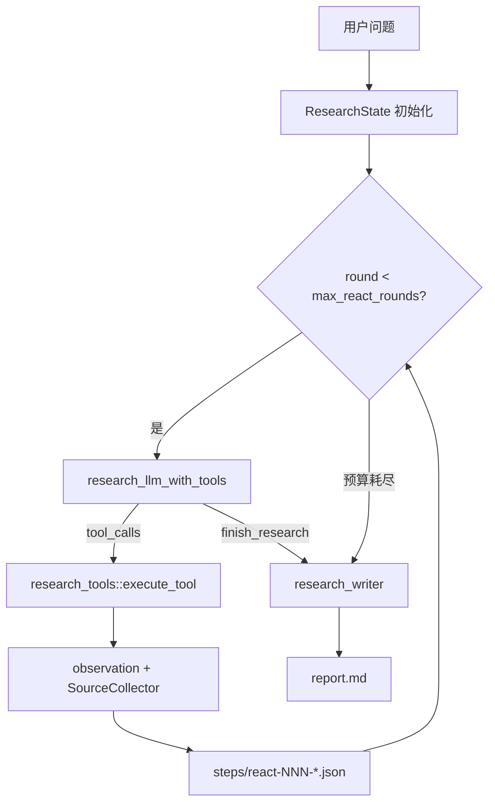

# 文献调研 ReAct 深循环改造方案

> 版本：0.2.15；状态：已落地  
> 前置：Phase 1～6（0.2.13～0.2.14）已落地固定流水线 Agent  
> 参考：[Local Deep Research langgraph_agent_strategy](https://github.com/LearningCircuit/local-deep-research/blob/main/src/local_deep_research/advanced_search_system/strategies/langgraph_agent_strategy.py)、[GPT Researcher researcher.py](https://github.com/assafelovic/gpt-researcher/blob/master/gpt_researcher/skills/researcher.py)、[GPT Researcher orchestrator.py](https://github.com/assafelovic/gpt-researcher/blob/master/multi_agents/agents/orchestrator.py)

---

## 1. 问题陈述

0.2.14 的「Planner / Researcher / Reflect / Writer」是 **Rust 硬编码流水线**，不是 ReAct：

- Researcher 不调用 LLM，检索词由 Planner 一次性产出
- Reflect 只执行一轮，最多 2 条 follow-up
- 工具不由 LLM 选择，无 native function calling

目标：改为 **LLM 自主选工具循环**（ReAct），研究结束后 **Writer 单独写报告**（对齐 GPT Researcher 的 conduct_research → write_report 分离）。

---

## 2. 设计原则

| 保留 | 改造 |
|------|------|
| 主交付物 `report.md` | 检索期改为 ReAct 循环 |
| `sources.jsonl` + `steps/` 证据链 | `steps/react-*` 记录每轮 tool/observation |
| 外网只存元数据、调研期不下载 PDF | `search_arxiv` 仍为 gated tool |
| 写库走 `proposals/` 审批 | ReAct 不提供写库 tool |
| MCP 只读 | **内置 Agent 与 MCP 共用 `research_tools`** |

**不引入** Python / LangGraph sidecar；复用开源项目的 **循环协议与 Collector 模式**，在 Rust 内实现。

---

## 3. 目标架构

```text
用户问题
  → Phase A: ReAct 循环（research_react.rs）
       LLM + tools → ToolExecutor → observation → sources.jsonl
       直到 finish_research / 预算耗尽
  → Phase A′: Reviewer 门控（research_reviewer.rs，最多 2 轮补检索）
  → Phase B: Writer（research_writer.rs）
       读 sources + outline → report.md
  → proposals/ 规则生成（不变）
```



---

## 4. 模块拆分

```text
src-tauri/src/
├── research.rs           # 会话、设置、Tauri 命令；run_research_agent 分发
├── research_tools.rs     # Tool 注册 + SourceCollector + execute_tool（MCP 共用）
├── research_llm.rs       # research_llm_completion + research_llm_with_tools
├── research_react.rs     # ReAct 主循环
├── research_reviewer.rs  # Reviewer 门控 + 补检索
├── research_subagent.rs    # research_subtopic 子 Agent
├── research_writer.rs    # 报告写作
└── mcp_server.rs         # 改调 research_tools
```

### 4.1 `research_tools.rs` — 对齐 LDR SearchResultsCollector

- `SourceCollector`：去重、`src-NNN` 编号、追加 `sources.jsonl`
- `ToolContext`：library_pool、workspace、allow_web、collector
- `tool_catalog(allow_web)` → OpenAI tools schema
- `execute_tool(ctx, name, args)` → observation 文本

| Tool | 说明 |
|------|------|
| `search_library` | FTS5 全文检索 |
| `search_arxiv` | arXiv 元数据（`allow_web_search` 时注册） |
| `get_paper` | 论文元数据 + 摘要 |
| `search_annotations` | 批注 quote/comment 检索 |
| `search_excerpts` | 写作摘录检索 |
| `update_outline` | 更新 `outline.md` |
| `finish_research` | 显式结束循环（参数 `summary`） |
| `research_subtopic` | 委派子问题给子 Agent（仅 ReAct，不进 MCP catalog） |

MCP 专用（不进 ReAct catalog）：`list_research_sessions`、`get_research_report`。

### 4.2 `research_react.rs`

- `ResearchState`：messages、collector、round、finished、finish_summary
- `run_react_loop(settings, session, library_pool)` → `FinishSummary`
- 停止条件：`finish_research`；`round >= max_react_rounds`；`tool_calls >= max_tool_calls`
- 无 native `tool_calls` 时走 JSON ReAct fallback（弱 tool 模型）；否则注入 nudge 重试

### 4.3 `research_writer.rs`

- `write_research_report(settings, session, sources, finish_summary, outline)` → `report.md`
- 单次 Writer LLM；强制 `[src-xxx]` 引用

### 4.4 `research_llm.rs`

- `research_llm_completion`（从 research.rs 迁出）
- `research_llm_with_tools`：OpenAI `tools` + `tool_choice: auto`，解析 `tool_calls`

---

## 5. 设置项变更

| 字段 | 类型 | 默认 | 说明 |
|------|------|------|------|
| `researchMode` | `pipeline` \| `react` | `react` | 旧流水线 / 新 ReAct |
| `researchDepth` | `quick` \| `standard` \| `deep` | `standard` | 深度预设 |
| `maxReactRounds` | number | 20 | ReAct 最大轮次 |
| `maxToolCalls` | number | 40 | 总 tool 调用上限 |
| `maxIterations` | number | 8 | **仅 pipeline 模式** |

深度预设映射：

| depth | max_react_rounds | max_tool_calls |
|-------|------------------|----------------|
| quick | 8 | 15 |
| standard | 20 | 40 |
| deep | 35 | 80 |

---

## 6. `steps/` 格式

```text
steps/
  001-react-llm.json
  002-react-tool-search_library.json   # { tool, args, observation, new_source_ids }
  003-react-finish.json                # { summary }
  ...
  0NN-writer-report.json
```

`pipeline` 模式保留旧步骤名（`planner-plan` 等）便于对比。

---

## 7. 分阶段实施

### Phase 7a — 工具层统一 ✅ 目标

- [x] `research_tools.rs` + SourceCollector
- [x] `search_annotations` / `search_excerpts`
- [x] `mcp_server` 改调 `execute_tool`
- [x] pipeline 模式改调 tools 层（去重逻辑统一）

### Phase 7b — LLM tools API ✅

- [x] `research_llm.rs` + `research_llm_with_tools`
- [x] JSON ReAct fallback

### Phase 7c — ReAct 主循环 ✅

- [x] `research_react.rs`
- [x] `research_writer.rs`
- [x] `run_research_agent` 按 `researchMode` 分发
- [x] 设置页 + `ResearchLlmSettings` 新字段

### Phase 7d — UI 进度

- [x] `ResearchView` 展示 `react-tool-*` 步骤（轮询 + label/detail）
- [x] `research_depth` / `research_mode` 设置控件

### Phase 7e — Reviewer 门控 ✅

- [x] ReAct 结束后 Reviewer LLM → 若有 gaps 再跑 ≤2 轮补检索 → Writer

### Phase 8 — 子 Agent ✅

- [x] 移植 LDR `research_subtopic`：主 Agent 委派子问题，共享 collector

---

## 8. System Prompt（研究 Agent）

1. 先 `search_library`，再按需 `search_arxiv`
2. 用 `get_paper` 深入单篇；用 `search_annotations` / `search_excerpts` 找用户笔记
3. 可用 `update_outline` 边搜边改大纲
4. 证据足够后 **必须** 调 `finish_research`，不要直接写长报告
5. 引用只用 collector 分配的 `[src-xxx]`

---

## 9. 风险与对策

| 风险 | 对策 |
|------|------|
| 模型不支持 tools | JSON ReAct fallback |
| 成本飙升 | depth 预设 + max_tool_calls |
| 重复搜索 | collector 去重 + observation 提示已搜过 |
| MCP 与 Agent 漂移 | 共用 `research_tools` |

---

## 10. 验收标准

1. `researchMode=react` 时，典型问题产生 ≥3 轮 tool 调用、`steps/react-*` 可追溯
2. `sources.jsonl` 与 `[src-xxx]` 在 `report.md` 中一致
3. MCP `search_library` / `get_paper` 行为与改造前一致
4. `researchMode=pipeline` 可回退旧行为
5. `npm run check` + `cargo test` 通过

---

## 11. Phase 9 衔接

ReAct 阶段 7 的 `steps/` 为摘要型日志；Phase 9 改为复用 [research-trajectory-plan.md](research-trajectory-plan.md) 中的 **DSH 官方栈**：

- `@deepseek-ai/dsh-session`：`append` / `deriveMessages` / `fork`（不自研）
- `@deepseek-ai/dsh-session-persistence-jsonl`：`.dsh-session/` 持久化
- `@deepseek-ai/dsh-client-ui-trajectory`：Trajectory UI 原组件嵌入（1:1 外观）
- Rust 调研编排经 Harness Bridge 追加 DSH 标准事件；`research_tools` 仍留在 Rust
